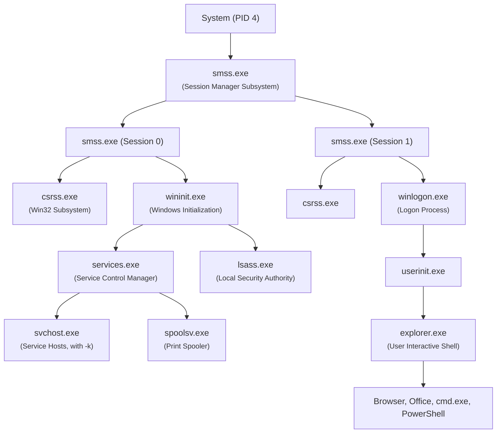

---
layout: agenda
title: Course Agenda
kicker: PV204 Overview
items:
  - { topic: "Motivation & Evidence Dynamics", desc: "Why volatile memory forensics beats static disk analysis" }
  - { topic: "Operating System Internals", desc: "Processes, threads, paging & kernel data structures" }
  - { topic: "Subverting the OS (DKOM)", desc: "Rootkit mechanics, process injection & unbacked memory" }
  - { topic: "Acquisition Physics", desc: "Live hardware seizure, hypervisors & Heisenberg effect" }
  - { topic: "Forensic Triage Tools", desc: "Redline, HBGary DDNA, Volatility 3, MemProcFS" }
  - { topic: "Hands-on Malware Labs", desc: "Real-world memory triage: Zeus, Conficker, and Bob samples" }
---

---
layout: two-cols
title: Why Memory Analysis?
kicker: The Human Factor
---

**The Patching Paradox**
* Critical security patches fix severe vulnerabilities...
* Yet production users reflexively hit *"Remind me later"*.

**Why We Need Volatile Forensics**
* Systems linger unpatched in enterprise fleets for months.
* When perimeter defenses fail, RAM preserves the running truth.

::right::

<ComicCard src="/images/xkcd-update.png" alt="XKCD #1328" />

<!--
XKCD #1328: https://xkcd.com/1328/
What’s the real cause of all the security issues on laptops and desktops? This one :)
-->

---
layout: two-cols
title: The Power of Volatile Data
kicker: Volatile vs. Static Truth
---

### <strong class="text-emerald-400 font-bold">Ephemeral & Volatile Data</strong>
* **Never Touches Disk**: Unsaved documents, web chat sessions, clipboard buffers.
* **Transient Evidence**: Vanishes the moment power is cut — must be seized live.

### <strong class="text-cyan-400 font-bold">Real-Time Execution State</strong>
* **Live Sockets**: Established TCP/UDP sessions, DNS cache, and listening ports.
* **Process Truth**: Shows what is *actually* executing in RAM vs. static disk binaries.

::right::

### <strong class="text-amber-400 font-bold">Bypassing Encryption Barriers</strong>
* **Plaintext Keys in RAM**: BitLocker (FVEK), VeraCrypt, and LUKS master keys.
* **Pre-Encryption Buffers**: Plaintext SSL/TLS traffic before HTTPS encapsulation.

### <strong class="text-rose-400 font-bold">Unmasking Stealthy Rootkits</strong>
* **Hidden Processes**: Malware that unlinks itself from OS reporting structures to evade Task Manager.
* **In-Memory Evasion**: Code injection, process hollowing, and payloads executed directly in RAM.

---
layout: two-cols
title: Secrets Trapped in RAM
---

**The Scope of Memory Exposure**
* Asymmetric private keys, TLS session tickets, active sessions.
* In-memory process caches hold plaintext credentials (`lsass.exe`).

**Hardware & Buffer Leaks**
* Vulnerabilities like Heartbleed, Spectre, and Meltdown harvest data directly from volatile memory, leaving zero traces in disk logs.

::right::

<ComicCard src="/images/xkcd-heartbleed.png" alt="XKCD #1354" />

<!--
XKCD #1354: https://xkcd.com/1354/
Or you could consider Spectre/Meltdown, which still have related techniques and speculative execution side-channel attacks that haven’t been fully mitigated in hardware.
-->

---
layout: two-cols
title: Challenges in Reverse Engineering
---

### <strong class="text-sky-400 font-bold">Obfuscation & Dynamic Packing</strong>
* **Packers & Crypters**: VMProtect, Themida, UPX, and multi-stage unpackers obscure static analysis.
* **Import Obfuscation**: Dynamic API hashing (ROR13, Murmur) hides imported API calls from the IAT.

### <strong class="text-amber-400 font-bold">Anti-Debugging Defenses</strong>
* **Environment Traps**: RDTSC timing checks, PEB `BeingDebugged`, and hardware breakpoint clearing (`Dr0`–`Dr3`).
* **Kernel Transitions**: Direct system calls (`syscall`) bypassing user-mode EDR hooks (`ntdll.dll`).

::right::

### <strong class="text-purple-400 font-bold">Anti-VM & Sandbox Evasion</strong>
* **Hardware Artifacts**: Hypervisor CPUID signatures, SIDT/SGDT instruction quirks, and RedPill checks.
* **Environmental Artifacts**: Screen resolutions, registry keys, MAC addresses, lack of user mouse movement.

### <strong class="text-emerald-400 font-bold">Why Memory Forensics Breaks Through</strong>
* **Execution Inevitability**: Regardless of packers, **the CPU can only execute decrypted code in RAM**.
* **Unvarnished State**: Memory captures payloads *after* unpacking, decrypting, and resolving APIs!

---
layout: full
title: The Complexity of Static Binaries (PE101)
kicker: Why Memory Forensics Bypasses Static Reversing
image: /images/pe-file-format.png
caption: Ange Albertini's PE101 poster (Corkami) — Static reversing requires decoding hundreds of intricate header fields; memory forensics captures the payload already decrypted and ready to run.
footer: false
---

---
layout: section
title: Memory Architecture
subtitle: How Operating Systems Organize Physical & Virtual RAM
index: 01
kicker: Section 1
bg: /images/monty-python-architecture.jpg
---

<SectionObjectives tone="sky" :items="[
  '<strong>Virtual vs. Physical RAM</strong>: Address spaces, paging & process isolation',
  '<strong>Register CR3 & MMU</strong>: Hardware translation to physical frames',
  '<strong>Forensic Reconstruction</strong>: Finding the memory root to unmask processes',
]" />

---
layout: vs
title: Physical vs. Virtual Memory
left:
  title: "Physical RAM (Hardware)"
  items: ["Hardware DRAM DIMMs on motherboard","Scrambled state: OS and all processes interleave","Capacity strictly bounded by physical chips","Where volatile forensic images are seized"]
right:
  title: "Virtual Memory (Book Index)"
  items: ["Private space per process (0-4 GB or 128 TB)","Process isolation prevents cross-process writes","Uniform paging in fixed 4 KB blocks","Oversubscription: backed by disk swap"]
---

<!--
Analogy: Every process gets a book with identical page numbers. But the OS translates those logical page numbers into completely different physical shelves in the warehouse (RAM).
-->

---
layout: default
title: Logical vs. Physical Address Space
---

<LogicalPhysicalMap class="w-full" />

<!--
Key Teaching Points for Logical vs. Physical Memory & Swapping:

1. The Virtual Illusion:
   - Each process (e.g. Browser, Text Editor) operates in its own private, linear address space starting at 0x00000000.
   - Both processes can use the exact same virtual addresses (e.g. 0x00400000 for Code) without any risk of collision.
   - Isolation: Process A cannot read or write Process B's memory because their page tables point to completely disjoint physical addresses.

2. The Translation Switchboard (Page Tables & MMU):
   - The OS maintains separate Page Tables for each process (anchored by the hardware CR3 register on x86).
   - Every entry (PTE) maps a Virtual Page Number (VPN) to a Physical Frame Number (PFN) and holds status flags.
   - The Valid/Present bit (V):
     * V = 1: Page is present in physical DRAM.
     * V = 0: Page is either unmapped or evicted to disk/swap.

3. Physical Hardware Reality (DRAM & Swap/Pagefile):
   - DRAM frames do not need to be contiguous. A continuous virtual buffer can be scattered across non-contiguous frames.
   - Memory Overcommit & Swap: Inactive/cold pages (e.g. background browser tabs, old undo history) are flushed to disk (pagefile.sys on Windows, swap partition/file on Linux) to free RAM for active tasks.

4. Page Fault Lifecycle (#PF Interrupt 14):
   - When a process touches a virtual page with V = 0, the MMU cannot translate it and generates a CPU interrupt (Interrupt 14, #PF).
   - The OS kernel page fault handler intercepts the trap, finds a free DRAM frame (or evicts another page to make room), reads the 4 KB page from SSD/disk into RAM, updates the PTE (V = 1, PFN = new frame), and invalidates the TLB.
   - The CPU re-executes the faulting instruction transparently—the application never knew it paused!
-->

---
layout: default
title: "The Forensic Keystone: Register CR3"
---

Physical RAM is a raw, scrambled dump of billions of bytes with no visible process boundaries. How does an analyst reconstruct running processes from a flat binary dump?

<CalloutCard tone="info" icon="lucide:key" class="my-6">
  <strong>The Directory Table Base (DTB):</strong><br/>
  The CPU register <code>CR3</code> holds the physical base address of each process's top-level page directory. When forensic tools scan a memory dump, they hunt for valid kernel <code>CR3</code> structures. <strong>Without CR3, virtual addresses cannot be resolved into executable code or running processes!</strong>
</CalloutCard>

* **Per-Process Page Tables**: Every process has its own CR3 pointer stored in kernel `_KPROCESS.DirectoryTableBase`.
* **Hardware Page Walk**: The Memory Management Unit (MMU) walks 4-level page tables (`PML4` $\to$ `PDPT` $\to$ `PD` $\to$ `PT`) to translate virtual offsets to physical frames.

---
layout: default
title: x86 Address Translation Pipeline
---

<X86Translation class="w-full" />

<CalloutCard tone="info" icon="lucide:info" class="mt-2 text-xs">
  <strong>Why No Segmentation Adder?</strong> Modern 32-bit & 64-bit OSes (Windows & Linux) configure segments with Base = 0 (Flat Memory Model), so Logical Address == Linear Virtual Address.
</CalloutCard>

<!--
Page sizes in modern architectures: 4 KB (standard), 2 MB (large/huge page), 1 GB (gigabyte page), and proposed 512 GB pages.
-->

---
layout: two-cols
title: 32-bit Address Space Partitioning
---

### Windows (x86 32-bit)
* **Default**: 2 GB User / 2 GB Kernel
* **`/3GB` switch**: 3 GB User / 1 GB Kernel

<AddressSpace mode="windows" class="mt-3" />

::right::

### Linux (x86)
* **Default**: 3 GB User / 1 GB Kernel
* **`HugeMem`**: 4 GB User / 4 GB Kernel

<AddressSpace mode="linux" class="mt-3" />

---
layout: two-cols
title: 64-bit Address Space Partitioning
---

### Windows 11 (x64 Canonical)
* **Canonical Split**: 128 TB User / 128 TB Kernel
* **Hardware Void**: ~16 Exabyte gap triggers `#GP` fault

<AddressSpace mode="win64" class="mt-3" />

::right::

### Linux (x86_64 Kernel 5.x/6.x)
* **Canonical Split**: 128 TB User (`TASK_SIZE_MAX`) / 128 TB Kernel
* **Direct Mapping**: Maps all physical DRAM 1:1 (`PAGE_OFFSET`)

<AddressSpace mode="linux64" class="mt-3" />

<!--
64-bit Virtual Address Space Architecture & Paging Notes:

1. Canonical Addressing & The Non-Canonical Hole:
   - Modern x86_64 / AMD64 CPUs implement 48-bit virtual addressing sign-extended to 64 bits (4-level paging).
   - Addresses must be in canonical form: bits 47 through 63 must be identical (all 0s for User space, all 1s for Kernel space).
   - Lower canonical range (User): 0x0000000000000000 to 0x00007FFFFFFFFFFF (128 TB).
   - Upper canonical range (Kernel): 0xFFFF800000000000 to 0xFFFFFFFFFFFFFFFF (128 TB).
   - The addresses in between are the "non-canonical hole" (~16 Exabytes). Any instruction attempting to dereference an address in this void is immediately trapped by the CPU MMU, generating a General Protection Fault (#GP).

2. Linux TASK_SIZE_MAX:
   - Defines the maximum virtual address accessible to user-space processes.
   - On x86_64 with 4-level paging, TASK_SIZE_MAX is 0x00007FFFFFFFF000 (~128 TB).
   - Any user-mode attempt to access memory at or above TASK_SIZE_MAX is blocked by hardware privilege checks, raising a SIGSEGV / page fault.

3. Linux PAGE_OFFSET (Direct Physical Mapping / Lowmem):
   - In 64-bit Linux, the kernel maps ALL available physical RAM 1:1 into kernel virtual memory starting at PAGE_OFFSET (0xFFFF888000000000 in 4-level paging).
   - For any physical memory frame P, virt = P + PAGE_OFFSET.
   - This direct linear mapping is critical for kernel performance and forms the backbone of memory forensics: acquisition tools (LiME) and Volatility can access physical frames directly via kernel pointers.

4. 5-Level Paging (PML5 / LA57):
   - High-end server processors (Intel Ice Lake+, AMD Zen 4+) support 57-bit virtual addressing (LA57) by adding a 5th level (PML5) to page tables.
   - Expands canonical address space from 256 TB to 128 Petabytes (64 PB User space + 64 PB Kernel space).
   - Physical memory bus addressing is expanded to 52 bits (up to 4 Petabytes of physical DRAM).
   - Supported in Linux since kernel 4.14 (CONFIG_X86_5LEVEL) and Windows 11 / Windows Server with 5-level paging enabled.

5. Authoritative References & Further Reading:
   - Linux Kernel Documentation (x86_64 MM): https://www.kernel.org/doc/html/latest/arch/x86/x86_64/mm.html
   - Linux 5-Level Paging: https://www.kernel.org/doc/html/latest/arch/x86/x86_64/5level-paging.html
   - Microsoft Learn (Memory Limits for Windows): https://learn.microsoft.com/en-us/windows/win32/memory/memory-limits-for-windows-releases
   - Intel 64 and IA-32 Architectures Software Developer's Manual (Vol 3A, Chap 4: Paging)
-->

---
layout: default
title: Memory Addresses & Pointers
---

<div class="grid grid-cols-2 gap-8 items-center h-full -mt-2">

<div>

**Virtual Pointers in Userland**
* Base addresses (`0x00400000`), stack pointers (`ESP`/`RSP`), PEB (`0x7FFE0000`).

**Why Pointers Rule Memory Forensics**
* Operating systems link running processes, loaded modules, and drivers through pointer chains in RAM.
* Rootkits tamper with list pointers to hide from detection APIs, but raw in-memory structures remain discoverable!

</div>

<div>
  <ComicCard src="/images/xkcd-pointers.png" alt="XKCD #138" maxHeight="340px" />
</div>

</div>

<!--
XKCD #138: https://xkcd.com/138/
-->

---
layout: two-cols
title: "Modern Architecture: ARM64 & Apple Silicon"
kicker: Beyond Classical x86
---

### <strong class="text-cyan-400 font-bold">Pure Paged Memory (No Segmentation)</strong>
* **Flat Address Space**: Completely abandons legacy x86 segmentation descriptors (`GDT`/`LDT`).
* **Hardware Enforced**: Flat 64-bit virtual addressing simplifies memory layout and pointer integrity.

### <strong class="text-amber-400 font-bold">Flexible Page Granules</strong>
* **Configurable Granule Sizes**: Supports 4 KB, 16 KB, and 64 KB base page sizes.
* **Apple Silicon Standard**: Linux/Android defaults to 4 KB; macOS on M-series standardizes on 16 KB granules.

::right::

### <strong class="text-emerald-400 font-bold">Dual Translation Base Registers</strong>
* **`TTBR0_EL0`**: Dedicated base register for user-space translations (lower half).
* **`TTBR1_EL1`**: Dedicated base register for kernel-space translations (upper half).
* **Zero Kernel TLB Flush**: Switching between user and kernel mode preserves kernel TLB caches!

<CalloutCard tone="info" icon="lucide:cpu" class="mt-4 text-xs">
  <strong>Forensic Relevance:</strong> Apple Silicon's 16 KB page granules and ARM Pointer Authentication (PAC) alter memory acquisition offsets, pool tags, and stack unwinding compared to standard x86_64 dumps. <em>(See Appendix for full translation diagrams)</em>.
</CalloutCard>

---
layout: section
title: OS Internals & DKOM
subtitle: Processes, Kernel Structures, and Rootkit Evasion
index: 02
kicker: Section 2
bg: /images/monty-python-dkom.jpg
---

<SectionObjectives tone="rose" :items="[
  '<strong>Kernel Objects</strong>: Process tracking via <code>_EPROCESS</code> & VAD trees',
  '<strong>DKOM Rootkits</strong>: Evading Task Manager by unlinking <code>ActiveProcessLinks</code>',
  '<strong>Traversal vs. Carving</strong>: Why list traversal misses what pool carving catches',
  '<strong>The RWX Red Flag</strong>: Spotting code injection via memory page protections',
]" />

---
layout: two-cols
title: "OS Kernel Structures: Process & Thread Tracking"
kicker: Executive Objects & Abstractions
---

### <strong class="text-sky-400 font-bold">The Executive Abstraction</strong>
* **Handles vs. Objects**: Userland holds handle tokens; the kernel manages `_EPROCESS`.
* **Kernel Pool Residency**: Allocated in non-paged pool memory (`Proc` tag).

### <strong class="text-cyan-400 font-bold">Lineage & Credentials</strong>
* **Process Lineage**: `UniqueProcessId` (PID) & parent PPID hierarchy.
* **Security Token**: `Token` (`_EX_FAST_REF`) holds user SID and privileges.

::right::

### <strong class="text-amber-400 font-bold">Memory & Execution</strong>
* **Paging Keystone**: `DirectoryTableBase` (CR3) links virtual space to physical DRAM.
* **VAD Descriptors**: `VadRoot` tree maps all private and mapped allocations.

### <strong class="text-purple-400 font-bold">Threads & Linkage</strong>
* **Thread Queue**: `ThreadListHead` anchors executing `_ETHREAD` structures.
* **Global Active Ring**: `ActiveProcessLinks` chains live processes for enumeration.

<!--
Speaker Notes:
- Handles vs. Objects: Applications never interact with _EPROCESS directly; they hold opaque HANDLES. The Windows Executive mediates all operations.
- Non-Paged Pool: _EPROCESS structures reside in non-paged kernel pool memory so they are never swapped to disk and cannot be accessed from user mode.
- Lineage & PPID: Process hierarchy is critical in forensics. Attackers use PPID spoofing to make malware look like a child of svchost.exe or explorer.exe.
- Security Token: Dictates privilege boundaries (e.g. SeDebugPrivilege) and user account context. Token stealing/duplication is a primary privilege escalation path.
- CR3 DTB: Without DirectoryTableBase, the MMU cannot translate virtual addresses to physical RAM frames.
- VAD Tree: A balanced AVL tree describing every VirtualAlloc allocation and DLL mapping. Hunting unbacked executable memory in the VAD is how we catch injected code.
- Thread Scheduling: Processes are passive resource containers; threads are the actual units of execution dispatched by the CPU.
-->

---
layout: default
title: "Anatomy of the _EPROCESS Block"
kicker: Kernel Data Structure Layout
---

```c
typedef struct _EPROCESS {
    KPROCESS             Pcb;                  // Dispatcher scheduling state
    EX_PUSH_LOCK         ProcessLock;
    LARGE_INTEGER        CreateTime;
    HANDLE               UniqueProcessId;      // PID
    LIST_ENTRY           ActiveProcessLinks;   // <-- Circular Doubly-Linked Node!
    PVOID                VadRoot;              // VAD Tree (Virtual Memory Maps)
    EX_FAST_REF          Token;                // Security context & privileges
    ULONG_PTR            DirectoryTableBase;   // CR3 (Physical DTB for MMU)
    UCHAR                ImageFileName[15];    // Executable name (ASCII)
    struct _ETHREAD*     ThreadListHead;       // Active threads in process
    ...
} EPROCESS, *PEPROCESS;
```

<!--
Speaker Notes:
- Embedded LIST_ENTRY Pattern:
  Instead of wrapping data inside list nodes (traditional container style), the Windows NT kernel embeds LIST_ENTRY directly inside the _EPROCESS struct.
  This allows an object to belong to multiple linked lists simultaneously with zero heap allocation overhead.

- The CONTAINING_RECORD Macro:
  When traversing ActiveProcessLinks, pointers point to the ActiveProcessLinks field (+0x088), not the start of _EPROCESS!
  The kernel and forensic tools recover the parent object using pointer arithmetic:
  #define CONTAINING_RECORD(address, type, field) ((type *)((char *)(address) - offsetof(type, field)))

- Non-Paged Pool Tagging:
  Allocated from non-paged kernel pool memory using the 4-byte ASCII tag 'Proc'.
  Even if unlinked from ActiveProcessLinks (DKOM), the physical pool tag remains discoverable by pool carving (psscan).
-->

---
layout: default
title: "ActiveProcessLinks & Doubly-Linked Lists"
kicker: OS Kernel Architecture
---

<ProcessLinkedList class="w-full" />

<CalloutCard tone="info" icon="lucide:git-commit" class="mt-2 text-xs">
  <strong>API Traversal Dependency:</strong> Windows APIs (<code>EnumProcesses</code>, Task Manager, process listing utilities) start at <code>PsActiveProcessHead</code> and follow <code>Flink</code> pointers sequentially. If a node is missing from this chain, standard tools never see it!
</CalloutCard>

---
layout: two-cols
title: "DKOM: Direct Kernel Object Manipulation"
---

### <strong class="text-rose-400 font-bold">The Rootkit Mechanism</strong>

**Pointer Unhooking**
* Kernel rootkits overwrite `ActiveProcessLinks.Flink` and `Blink` pointers.
* Detaches the malicious `_EPROCESS` block from the circular linked list.

**API Invisibility**
* The unlinked process vanishes from Task Manager and OS enumeration APIs.
* Standard system calls traverse the list and report zero malicious activity!

::right::

### <strong class="text-emerald-400 font-bold">The Rootkit Paradox</strong>

**Execution Demands Scheduling**
* To inflict damage, malware must execute code on CPU cores.
* Threads must stay registered in the CPU dispatcher database.

**The Forensic Reality**
* Even if unlinked from process lists, all threads and VAD pages remain in RAM.
* Physical pool carving finds the stealth process immediately!

<!--
Historical milestone paper: Jamie Butler (Black Hat USA 2004) - 'FU Rootkit / Direct Kernel Object Manipulation':
http://www.blackhat.com/presentations/bh-usa-04/bh-us-04-butler/bh-us-04-butler.pdf
-->

---
layout: vs
title: List Traversal vs. Pool Carving
left:
  title: "List Traversal (Pointer Walking)"
  items: ["Traverses the kernel ActiveProcessLinks list","Fast and follows official OS pointer chains","Vulnerability: blind to unlinked DKOM rootkits!","Task Manager & standard APIs see zero traces"]
right:
  title: "Pool Carving (Raw Memory Scanning)"
  items: ["Scans raw physical RAM byte-by-byte","Carves _EPROCESS structures by pool tag ('Proc')","Unmasks hidden rootkits & terminated processes","Classroom Analogy: checks physical chairs in aisles"]
---

<!--
The Classroom Attendance Roster Analogy:
Imagine a student erases their name from the attendance sheet. When the teacher reads the list (pslist), the student is reported absent! But if the teacher walks down the aisles inspecting physical chairs (psscan), the student is caught red-handed.
-->

---
layout: two-cols
title: "High-Value Memory Structures: Process & OS State"
kicker: Forensic Goldmines in RAM
---

### <strong class="text-sky-400 font-bold">Execution State & Lineage</strong>
* **`_EPROCESS` & `_ETHREAD`**: PIDs, parent PPIDs, start times, security tokens.
* **VAD Descriptors**: AVL trees tracking every memory page allocation.
* **Loaded Modules (`PEB->Ldr`)**: In-memory doubly-linked lists of loaded DLLs.

::right::

### <strong class="text-emerald-400 font-bold">Network & System Objects</strong>
* **Network Endpoints**: Active sockets, listening ports, remote C2 endpoints.
* **Object Handle Tables**: Open files, named pipes, process tokens, sections.
* **Synchronization Mutexes**: Named mutants used as malware infection markers.

<!--
Speaker Notes:
- _EPROCESS & _ETHREAD: Give the complete execution picture—lineage, thread state, and security context.
- VAD Trees: Every VirtualAlloc or DLL mapped into a process has a VAD node. Hunting unbacked executable memory in the VAD is primary detection.
- PEB->Ldr: Attackers unlink DLLs from InLoadOrderModuleList to hide them from enumeration (Ldr unlinking).
- Network: Memory captures ephemeral C2 connections that never hit disk logs.
- Handles & Mutexes: Malware often creates a unique mutex to prevent multiple infections on the same host (e.g., 'Global\MyMalwareMutex').
-->

---
layout: two-cols
title: "High-Value Memory Structures: Code & Secrets"
kicker: Ephemeral Evidence & Credentials
---

### <strong class="text-amber-400 font-bold">In-Memory Code Artifacts</strong>
* **Injected Shellcode**: Unbacked executable allocations in target processes.
* **Execution History**: Prefetch, Shimcache, UserAssist cached in RAM.
* **Decrypted Buffers**: Unpacked payloads and staging configs in memory.

::right::

### <strong class="text-rose-400 font-bold">Plaintext Secrets & Caches</strong>
* **Credential Material**: Passwords, Kerberos tickets, NT hashes in `lsass.exe`.
* **Registry Hives**: SAM, SYSTEM, and SOFTWARE held in memory cache.
* **DNS Resolver Cache**: Recent domain resolutions before DNS cache flush.

<!--
Speaker Notes:
- Unpacked Code: Modern malware is packed or encrypted on disk. Memory analysis catches it after it unpacks itself in RAM.
- LSASS Secrets: Mimikatz and similar tools extract plaintext credentials, Kerberos TGT/TGS tickets, and NTLM hashes directly from lsass.exe process memory.
- In-Memory Registry: In-memory registry structures can be extracted without file locking issues present on a live filesystem.
- DNS Cache: Contains recent lookups including fast-flux or dynamic C2 domains that might have already expired from external DNS servers.
-->

---
layout: default
title: "Memory Page Protections & W^X"
kicker: Hardware-Enforced Boundaries
---

<div class="grid grid-cols-4 gap-3 my-2 text-center text-xs font-mono">
  <div class="p-2.5 rounded bg-slate-900/80 border border-slate-700/60">
    <div class="font-bold text-slate-300">PAGE_READONLY</div>
    <div class="text-[11px] text-slate-400 font-sans mt-0.5">Constants, Read Data</div>
    <div class="mt-1 text-[10px] text-sky-400 font-bold">Legitimate (RO)</div>
  </div>
  <div class="p-2.5 rounded bg-slate-900/80 border border-slate-700/60">
    <div class="font-bold text-slate-300">PAGE_READWRITE</div>
    <div class="text-[11px] text-slate-400 font-sans mt-0.5">Stack, Heaps, Globals</div>
    <div class="mt-1 text-[10px] text-cyan-400 font-bold">Data Only (RW)</div>
  </div>
  <div class="p-2.5 rounded bg-slate-900/80 border border-slate-700/60">
    <div class="font-bold text-slate-300">PAGE_EXECUTE_READ</div>
    <div class="text-[11px] text-slate-400 font-sans mt-0.5">Code Sections (.text)</div>
    <div class="mt-1 text-[10px] text-emerald-400 font-bold">Legitimate Code (RX)</div>
  </div>
  <div class="p-2.5 rounded bg-rose-950/70 border-2 border-rose-500 shadow-md ring-2 ring-rose-500/20">
    <div class="font-bold text-rose-200">PAGE_EXECUTE_READWRITE</div>
    <div class="text-[11px] text-rose-300 font-sans mt-0.5">Self-Modifying / Staged</div>
    <div class="mt-1 text-[10px] text-rose-400 font-bold uppercase tracking-wider">⚠️ Red Flag (RWX)</div>
  </div>
</div>

<div class="grid grid-cols-2 gap-4 mt-3 text-xs leading-relaxed text-slate-300">
  <div class="p-3 bg-slate-900/60 rounded-lg border border-slate-800">
    <strong class="text-sky-300 block mb-1 text-sm">W^X (Write XOR Execute) / DEP</strong>
    Hardware MMU policy: Memory may be writable <em>or</em> executable, but <strong>never both</strong> simultaneously during legitimate program execution.
  </div>
  <div class="p-3 bg-slate-900/60 rounded-lg border border-slate-800">
    <strong class="text-amber-300 block mb-1 text-sm">Staging Process Injection</strong>
    Malware allocates RWX memory in target processes via <code>VirtualAllocEx</code> to assemble payloads on the fly before jumping execution.
  </div>
</div>

<CalloutCard tone="warn" icon="lucide:shield-alert" class="mt-3 text-xs">
  <strong>The RWX Red Flag:</strong> Legitimate binaries strictly separate code (<code>.text</code> = RX) from data (<code>.data</code> = RW). A memory page that is simultaneously <strong>writable AND executable (RWX)</strong> is the primary signature of unbacked shellcode staging!
</CalloutCard>

<!--
Speaker Notes:
- W^X Principle: Enforced by the CPU MMU via the No-Execute (NX/XD) page table bit.
- Why RWX occurs in malware: Attackers need to write shellcode into memory, decrypt it, and immediately execute it without calling VirtualProtect to switch permissions (which creates telemetry for EDRs).
- Legitimate exceptions: Just-In-Time (JIT) compilers (e.g. V8 in Chrome, .NET CLR) do allocate RWX memory, which forensic analysts must filter out.
-->

---
layout: default
title: "Process & DLL Injection Mechanics"
kicker: Memory Manipulation Techniques
---

<ProcessInjectionFlow class="w-full" />

<!--
Speaker Notes:
- Remote Thread Injection:
  1. Attacker calls OpenProcess with PROCESS_ALL_ACCESS to get a handle on the victim.
  2. VirtualAllocEx allocates a new unbacked memory region marked PAGE_EXECUTE_READWRITE.
  3. WriteProcessMemory writes the raw shellcode or DLL path into that space.
  4. CreateRemoteThread dispatches an execution thread pointing directly at the buffer.
  - Forensic signature: Private committed memory with RWX protection that has NO file backing on disk (spotted by malfind).

- Process Hollowing (RunPE):
  1. Attacker spawns a trusted binary (e.g. svchost.exe) in a suspended state (CREATE_SUSPENDED).
  2. NtUnmapViewOfSection hollows out the original legitimate executable image from memory.
  3. VirtualAllocEx allocates replacement memory at the image base, and WriteProcessMemory writes the malicious PE headers & sections.
  4. SetThreadContext rewrites the thread's instruction pointer (EIP/RIP) to the evil entry point, then calls ResumeThread.
  - Forensic signature: In-memory PE header mismatch compared to on-disk image, and hollowed VAD allocations.
-->

---
layout: bigtype
title: "And Now for Something Completely Practical..."
subtitle: "The formal architecture theory is behind us. Now we move from hardware physics to the battlefield: acquisition mechanics, rootkits, and real-world triage."
kicker: Intermission · Monty Python Edition
bg: /images/monty-python-intermission.jpg
glow: true
---

<div class="mt-8 flex items-center justify-center gap-3 text-slate-300 italic text-base drop-shadow-md">
  <span class="text-amber-400 font-bold not-italic">Scene:</span>
  <span>"And now for something completely different: A forensic analyst with a raw RAM dump."</span>
</div>

---
layout: two-cols
title: Endless Updates & Breaches
kicker: The Systemic Reality
---

**The Update Fatigue Paradox**
* Infinite update chains, popups, and user numbness.
* Attackers exploit the delay between patch release and enterprise rollout.

**Transition to Volatile Acquisition**
* Live triage begins where perimeter defenses failed.
* Next up: How to seize RAM without corrupting evidence.

::right::

<ComicCard src="/images/xkcd-adobe-update.png" alt="XKCD #1197" />

<!--
XKCD #1197: https://xkcd.com/1197/
The joke is from 2013, but it’s still pretty good and accurate. There’s no extra hidden meaning of this joke right here; it’s just to give students a short break and relax a bit before diving into acquisition.
-->

---
layout: two-cols
title: The "Keep It Alive" Era
kicker: Forensic Lore vs. Modern Reality
---

### <strong class="text-amber-400 font-bold">The Volatility Catch-22</strong>

Picture an evidence seizure from the early BitLocker era: a seized PC is running with full-disk encryption keys residing solely in volatile DRAM. Pull the power plug, and the keys evaporate into thermal noise. Let the screensaver engage, and the volume seals shut.

The response was this surreal kit: examiners clamped the **WiebeTech HotPlug** onto the live mains cable to seamlessly switch power to a mobile battery, inserted a hardware **mouse jiggler** to defeat idle timers, and drove the humming computer across the city in a police van.

::right::

<div class="flex flex-col h-full justify-start gap-3">
  <div class="rounded overflow-hidden border border-line bg-surface-bg p-1 shadow-sm flex items-center justify-center">
    
  </div>

  <CalloutCard tone="info" icon="lucide:sparkles" class="text-xs">
    <strong>The 2026 Reality:</strong> Today, targets are laptops or cloud VMs, and modern standby locks TPM keys anyway. We don't drive running PCs in vans—we <strong>triage and dump RAM on-site</strong> in 90 seconds.
  </CalloutCard>
</div>

<!--
Presenter Notes:
- "Ask the audience: What do you think this Pelican case and mouse jiggler are for?"
- "Tell the story: Back in the 2000s and early 2010s, if an encrypted desktop was running, pulling the plug meant losing the BitLocker/TrueCrypt keys forever. Investigators actually used this HotPlug device to switch a live PC to battery power and drive it across the city in a van!"
- "Reference the Silk Road (Ross Ulbricht) arrest: in 2013 at the SF library, FBI agents staged a fake couple fight to distract Ross so another agent could grab his open laptop before he could close the lid."
- "Modern contrast: Today, driving a running machine is asking for a kernel panic or thermal shutoff. With modern laptops, TPM 2.0, and fast live acquisition tools (WinPmem, DumpIt), standard procedure is to acquire memory right on the desk before touching anything else."
-->

---
layout: section
title: Memory Acquisition
subtitle: Live Seizure Physics, Hypervisors & Footprint Mitigation
index: 03
kicker: Section 3
bg: /images/monty-python-acquisition.jpg
---

<SectionObjectives tone="emerald" :items="[
  '<strong>Seizure Playbook</strong>: Choosing VM snapshots, live drivers, or DMA',
  '<strong>Heisenberg Footprint</strong>: Minimizing RAM perturbation during capture',
  '<strong>Non-Volatile Backings</strong>: Carving <code>pagefile.sys</code>, crash dumps & keys',
  '<strong>Forensic Ethics & OpSec</strong>: Handling plaintext secrets & personal data',
]" />

---
layout: two-cols
title: Memory (Re)sources
---

### <strong class="text-emerald-400 font-bold">Volatile RAM (Physical DRAM)</strong>
* **The Prime Target**: Holds active process trees, network sockets, unencrypted buffers.
* **Hypervisor Captures**: Cleanest acquisition via `.vmem` (VMware) or `.sav` (VirtualBox).
* **High Volatility**: State disappears completely upon power disconnection.

::right::

### <strong class="text-amber-400 font-bold">Non-Volatile Memory Backings</strong>
* **Paging Files (`pagefile.sys`)**: OS swap stores flushed memory pages from dormant processes; rich source of historical strings.
* **Hibernation (`hiberfil.sys`)**: Compressed kernel snapshot of physical RAM created before power-down (`PO_MEMORY_IMAGE`).
* **Crash Dumps (`MEMORY.DMP`)**: BSOD kernel or full dumps written by Windows memory manager.

---
layout: default
title: Memory Acquisition Decision Tree
---

<AcquisitionDecisionTree class="w-full" />

<!--
Key Decision Factors for Memory Preservation:

1. Virtual vs. Physical Machine:
   - If Virtual Machine (ESXi, Hyper-V, Proxmox, KVM, VMware Workstation):
     * ALWAYS pause or snapshot the VM from the hypervisor host.
     * Extracts .vmem, .sav, or snapshot files with ZERO guest OS footprint.
     * Bypasses all in-guest rootkits, anti-forensic hooks, or credential shredders.

2. Power State (Live vs. Cold):
   - If Powered Off:
     * NEVER boot the live machine (booting overwrites swap files and initializes state).
     * Acquire bit-stream disk image and carve memory backings: hiberfil.sys (compressed active RAM snapshot), pagefile.sys, and MEMORY.DMP crash dumps.

3. Live System Privileges:
   - If Admin / Root access is available:
     * Use trusted, signed live capture tools (WinPmem, DumpIt, AVML, LiME).
     * Stream directly across the local network (netcat / SSH) or write to an external fast NVMe drive to minimize memory footprint.
   - If No Admin / Locked Workstation:
     * Hardware DMA attacks / bus sniffing (PCILeech, Thunderbolt / PCIe DMA) can bypass lock screens and OS authorization by reading physical RAM directly from the system bus.
-->

---
layout: two-cols
title: Memory Acquisition Methods
---

### <strong class="text-cyan-400 font-bold">Hypervisor & Out-of-Band</strong>
* **VM Snapshots**: Pausing guest VMs and extracting `.vmem` files creates **zero software footprint** inside the guest OS.
* **Hardware DMA Probes**: Direct memory access via PCIe / Thunderbolt bus sniffers (e.g. PCI leech) bypassing OS kernel entirely.

::right::

### <strong class="text-rose-400 font-bold">Live OS & Enterprise Agents</strong>
* **Kernel Driver Seizure**: Software tools (`WinPmem`, `DumpIt`, `LiME`, `AVML`) load signed drivers to map physical memory.
* **Remote Fleet Response**: Pre-deployed enterprise frameworks (`Velociraptor`, EDR live response) stream memory over TLS.

---
layout: two-cols
title: Common Acquisition Challenges
---

### <strong class="text-amber-400 font-bold">The Heisenberg Footprint</strong>
* **Observer Effect**: Executing acquisition software inevitably alters volatile RAM, overwriting unallocated memory and altering caches.
* **Golden Rule**: Minimize driver footprint; stream image straight to external media or network sockets.

### <strong class="text-sky-400 font-bold">Paging & Memory Smear</strong>
* **Dynamic Smear**: Because the OS keeps running during dump creation, pages change mid-capture.
* **Pagefile Splitting**: Inactive malicious code blocks may reside in `pagefile.sys` on disk.

::right::

### <strong class="text-purple-400 font-bold">Full-Disk Encryption (FDE)</strong>
* **The Encryption Dilemma**: Powering down an active laptop triggers BitLocker / FileVault lockdown.
* **Plaintext Keys**: Live memory acquisition extracts volume master keys (FVEK) to decrypt underlying disk images.

### <strong class="text-rose-400 font-bold">The Privacy & Ethical Dilemma</strong>
* **Collateral Capture**: Raw RAM indiscriminately dumps private browser tabs, password vaults, personal chats, and medical records unrelated to the incident.
* **Forensic Mandate**: Strict data minimization, secure handling, and legal boundaries must govern volatile evidence collection.

---
layout: steps
title: Local Acquisition Best Practices
steps:
  - { icon: "lucide:shield-check", title: "Elevated Drivers", desc: "Direct physical RAM access strictly requires root/admin to load signed kernel drivers (WinPmem, LiME)." }
  - { icon: "lucide:hard-drive-download", title: "External Output", desc: "Never write dump files to the system drive! Overwrites deleted files and MFT. Stream to USB or netcat." }
  - { icon: "lucide:cpu", title: "Analysis VM Sizing", desc: "Allocate small RAM (2–4 GB) in malware labs for exponentially faster dumps, and disable guest swap." }
---

---
layout: two-cols
title: Remote Enterprise Triage
---

### <strong class="text-sky-400 font-bold">Enterprise Fleet Reach</strong>
* **Triage at Global Scale**: Collect volatile forensic artifacts across thousands of endpoints without travel.
* **Incident Velocity**: Minutes from initial detection alert to active process and socket triage.

::right::

### <strong class="text-emerald-400 font-bold">Footprint & Stream Security</strong>
* **Pre-Allocated Memory**: Dedicated response agents (e.g. Velociraptor) avoid allocating new execution pages.
* **Encrypted TLS Stream**: Evidence streams encrypted directly to forensic collection servers without writing temporary files to local disk.

<!--
Very useful for fast Incident Response across large enterprise fleets without physical travel. Requires enterprise EDR/XDR agents or query frameworks like Velociraptor.
-->

---
layout: default
title: Enterprise Forensics Tooling
---

Modern enterprise DFIR relies on automated query engines rather than manual live memory dumps:

**Velociraptor (Rapid7)**
* Powerful endpoint visibility tool using VQL (Velociraptor Query Language).
* Direct memory hunting, YARA scanning, and process extraction across 10,000+ hosts simultaneously.

**Commercial Incident Response Platforms**
* **Binalyze AIR**: Automated compromise assessments and automated evidence acquisition.
* **Cloud EDR/XDR**: Live response interactive shells (CrowdStrike, SentinelOne, Defender for Endpoint).

**Hardware Acquisition Implants**
* PCIe DMA devices (PCILeech) for physical hardware seizure bypassing OS locks completely.

---
layout: section
title: Forensic Triage Tools
subtitle: Redline, HBGary DDNA, Volatility 3, and MemProcFS
index: 04
kicker: Section 4
bg: /images/monty-python-triage.jpg
---

<SectionObjectives tone="sky" :items="[
  '<strong>Toolchain Spectrum</strong>: Pioneers (Redline, DDNA) to Volatility 3 & MemProcFS',
  '<strong>Volatility Triage</strong>: Hunting hidden processes, sockets & injected code',
  '<strong>Anomaly Detection</strong>: Flagging lineage violations & malware mutexes',
  '<strong>Raw Extraction</strong>: Wide strings (<code>UTF-16LE</code>) & file carving (<code>foremost</code>)',
]" />

---
layout: two-cols
title: Memory Analysis Ecosystem
---

### <strong class="text-sky-400 font-bold">Historical Pioneers (GUI & Triage)</strong>
* **FireEye Redline**: Free Windows GUI triage; pioneered visual timeline density ("Time Wrinkles") and Malware Risk Index (MRI).
* **HBGary Responder Pro**: Visionary commercial suite by Greg Hoglund; invented Digital DNA (DDNA) behavioral gene sequencing.

::right::

### <strong class="text-emerald-400 font-bold">The Open Source Standard</strong>
* **The Volatility Framework**: The de facto global standard created by Aaron Walters and the Volatility Foundation.
* **Modern Successors**: High-speed memory mounting (**MemProcFS**) and enterprise query engines (**Velociraptor**).

---
layout: two-cols
title: "FireEye Redline & \"Time Wrinkles\""
---

<div class="flex h-full items-center justify-center p-2">
  <div
    class="p-2 rounded-xl max-w-full"
    style="background-color: var(--surface-bg, var(--ink-2)); border: var(--rule-w, 1px) solid var(--line); box-shadow: var(--surface-shadow, 0 18px 42px -28px rgba(0,0,0,0.5));"
  >
    
  </div>
</div>

::right::

**The "Time Wrinkles" Innovation**
* Solved timeline analysis by graphing density spikes around incident windows.
* Clustered forensic events across time to highlight anomalous bursts.

**Malware Risk Index (MRI)**
* Automated heuristic risk rating for processes.

**Why DFIR Moved On**
* Sluggish on modern multi-GB dumps; Windows-only.
* Replaced today by **Velociraptor**, **Volatility 3**, and **MemProcFS**.

<!--
Support for macOS and Linux memory artifacts was added in Redline in 2020, but it remains predominantly a Windows-centric triage tool.
-->

---
layout: two-cols
title: HBGary Responder Pro & Digital DNA
---

<div class="flex h-full items-center justify-center p-2">
  <div
    class="p-2 rounded-xl max-w-full"
    style="background-color: var(--surface-bg, var(--ink-2)); border: var(--rule-w, 1px) solid var(--line); box-shadow: var(--surface-shadow, 0 18px 42px -28px rgba(0,0,0,0.5));"
  >
    
  </div>
</div>

::right::

**Behavioral Genotyping in RAM**
* Pioneered by rootkit researcher **Greg Hoglund** (HBGary).
* First engine to treat memory forensics as **gene sequencing**.

**Why DDNA Was Ahead of Its Time**
* Disassembled unbacked code blocks across all processes.
* Mapped byte patterns into traits (e.g. *API hashing + raw sockets*).

**The Modern Void**
* Modern tools still predominantly output raw tabular findings (unbacked memory pages, open sockets).
* Automated composite "gene scoring" across multiple artifacts remains an industry ideal.

<!--
Obsolete and unavailable for a long time, but it pioneered groundbreaking behavioral heuristics.
Commercial successor / alternative references:
- GoSecure Responder Pro: https://www.gosecure.net/responder-pro
- CounterTack DDNA SC Magazine Overview: https://cdn2.hubspot.net/hubfs/150964/CounterTack_DDNA_SCMagazine_030117-1.pdf
-->

---
layout: two-cols
title: "Digital DNA: Behavioral Genotyping in RAM"
kicker: Trait Combination Scoring
---

### <strong class="text-rose-400 font-bold">Execution & Privilege Genes</strong>

**Unbacked Execution & Packing**
* Executing from non-file-backed allocations (`PAGE_EXECUTE_READWRITE`).
* Runtime unpacker stubs and dynamic API resolving by hash (e.g. ROR13).

**Privilege & Pointer Tampering**
* Direct kernel object manipulation (DKOM) to hide processes.
* Token privilege manipulation (`SeDebugPrivilege`) and SSDT/dispatch table hooks.

::right::

### <strong class="text-emerald-400 font-bold">Communication & Composite Scoring</strong>

**Persistence & Foreign Injection**
* Injected threads in critical system binaries (`lsass.exe`, `explorer.exe`).
* Unexpected raw socket endpoints and autostart service descriptors in RAM.

**Automated Threat Scoring (0–100)**
* Benign tools show 1–2 isolated traits (e.g. packed software).
* Implants display lethal trait combinations in the same address space.
* Sums weighted trait scores to prioritize high-risk processes instantly!

---
layout: two-cols
title: "Responder Pro: DDNA Trait Severity Scoring"
---

<div class="flex h-full items-center justify-center p-2">
  <div
    class="p-2 rounded-xl max-w-full"
    style="background-color: var(--surface-bg, var(--ink-2)); border: var(--rule-w, 1px) solid var(--line); box-shadow: var(--surface-shadow, 0 18px 42px -28px rgba(0,0,0,0.5));"
  >
    
  </div>
</div>

::right::

**Visual Severity & Weighting**
* **Red/Orange Bars**: Immediate visual indicator of anomalous trait density.
* **Weight Scores**: Individual heuristic weights sum into module threat ratings.

**Specific Malicious Genes Identified**
* **`F6 E3`**: Injects or writes code directly into foreign process memory.
* **`35 99`**: Modifies process access tokens and privileges (`SeDebug`).
* **`1B 2A`**: Reads unmapped virtual memory of another process.
* **`80 10`**: Manually constructs obfuscated strings at runtime.

**Triage Acceleration**
* Quickly isolates suspicious modules without manual disassembler reversing.

---
layout: full
title: "Responder Pro: Visual Canvas Disassembler"
image: /images/responder-canvas.png
caption: "Responder Pro: Visual Canvas In-Memory Disassembler & Control Flow Graph"
footer: false
---

---
layout: default
title: The Volatility Framework
---

The de facto open-source standard for volatile memory extraction and analysis:

* **Open Architecture**: 100% Python-based, cross-platform, modular plugin pipeline.
* **Symbol-Driven Reconstruction**: Resolves OS structures directly from symbol tables (PDB / DWARF / JSON ISF).
* **Comprehensive Footprint**: Decodes processes, threads, network sockets, drivers, security tokens, clipboard, registry hives, and mutexes.

<CalloutCard tone="info" icon="lucide:terminal" class="mt-6">
  <strong>Dual Toolchain Available in Lab:</strong><br/>
  Use <code>vol</code> (Volatility 2) for legacy Windows XP artifacts (e.g. raw UDP scans, <code>dnscache</code>) and <code>vol3</code> (Volatility 3) for modern 64-bit triage with automated symbol downloading.
</CalloutCard>

---
layout: vs
title: Volatility 2 vs. Volatility 3
left:
  title: "Volatility 2 (Legacy)"
  items: ["Python 2.7 runtime (end-of-life)","Rigid OS profile strings: WinXPSP2x86","Deep legacy socket carving: connscan, sockets","CLI command: vol"]
right:
  title: "Volatility 3 (Modern)"
  items: ["Modern Python 3 modular codebase","Dynamic symbols: automated Microsoft PDB / ISF","Unified single codebase across Win/Linux/Mac","CLI command: vol3"]
---

---
layout: two-cols
title: The Modern Memory Forensics Landscape
---

### <strong class="text-sky-400 font-bold">Deep Offline Forensic Engines</strong>
* **Volatility 3 (Python 3)**:
  * Symbol-driven reconstruction with automated Microsoft PDB / Linux ISF downloading.
  * Modular plugin architecture for process carving, VAD tree analysis, and registry decoding.

::right::

### <strong class="text-emerald-400 font-bold">High-Speed & Enterprise Triage</strong>
* **MemProcFS (C/Rust)**:
  * Mounts raw RAM dumps as a virtual filesystem (`/sys/`, `/pid/`, `/forensics/`).
  * Instant string search, DMA hardware integration, and automated timeline generation.
* **Velociraptor (Go / Rapid7)**:
  * Fleet-wide endpoint visibility; sweeps 50,000+ endpoints concurrently using VQL queries.

---
layout: two-cols
title: What to Hunt for in Memory?
---

### <strong class="text-sky-400 font-bold">Process & Memory Anomalies</strong>
* **Lineage Violations**: Abnormal parent-child relationships (e.g. `wordpad` spawning `cmd`).
* **Hidden Processes**: Processes unlinked from `ActiveProcessLinks` (revealed via `psscan`).
* **Injected Code**: Unbacked executable allocations marked `PAGE_EXECUTE_READWRITE` (`malfind`).

### <strong class="text-cyan-400 font-bold">Network Telemetry</strong>
* **C2 Channels**: Active TCP sessions and listening UDP sockets tied to malicious PIDs.
* **DNS Resolution**: Domains resolved before network termination carved from `dnsrslvr.dll`.

::right::

### <strong class="text-amber-400 font-bold">Execution History Traces</strong>
* **Console Buffers**: Recent command-line history carved via `cmdscan` and `consoles`.
* **Program Execution**: In-memory registry traces from Shimcache, Prefetch, and UserAssist.

### <strong class="text-rose-400 font-bold">In-Memory Secrets & Mutexes</strong>
* **Infection Markers**: Named mutexes created by malware to prevent double infection.
* **Plaintext Secrets**: Decrypted TLS buffers, Kerberos tickets, and cached NT password hashes.

---
layout: diagram
title: Windows Process Lineage (Expected Tree)
note: Legitimate Windows processes follow a deterministic hierarchy stemming from System (PID 4)
---



---
layout: two-cols
title: Spotting Process Masquerading
---

### <strong class="text-rose-400 font-bold">Parentage & Path Violations</strong>
* **Parent Anomalies**: `svchost.exe` must be spawned by `services.exe` — if spawned by `explorer.exe` or `cmd.exe`, it is an impostor.
* **Path Squatting**: System binaries must run from `System32`; any `svchost.exe` in `AppData` or `Temp` is malicious.
* **Typo-Squatting**: Subtly misspelled names: `scvhost.exe`, `lsas.exe`, `csrs.exe`.

::right::

### <strong class="text-amber-400 font-bold">Instance Counts & Memory Clues</strong>
* **Singleton Violations**: Legitimate systems run exactly ONE instance of `wininit.exe`, `services.exe`, and `lsass.exe`. Two `lsass` processes = active compromise!
* **Command Line Flags**: `svchost.exe` without the `-k <group>` flag is an impostor.
* **Process Hollowing**: Legitimate path on disk, but memory contains unbacked executable VADs (`PAGE_EXECUTE_READWRITE`).

---
layout: default
title: Known Bad Mutexes (Malware Infection Markers)
---

Malware frequently creates named mutexes to prevent infecting the same host twice:

| Malware Family | Mutex Name Pattern | Description |
| :--- | :--- | :--- |
| **Conficker** | `.*-7` and `.*-99` | Net-worm worm mutex algorithm |
| **Sality.AA** | `Op1mutx9` | File infector / polymorphic virus |
| **Sality.W** | `u_joker_v3.06` | Sality backdoor variant |
| **Flystud** | `Hacker.com.cn_MUTEX` | Chinese crimeware backdoor |
| **NetSky** | `'D'r'o'p'p'e'd'S'k'y'N'e't'` | Mass-mailing email worm |
| **Poison Ivy** | `)!VoqA.I4` | Widely used remote access trojan (RAT) |
| **Koobface** | `35fsdfsdfgfd5339` | Social networking botnet |

<!--
Reference: Adam's Hexacorn blog - 'Santa's Bag of Mutants':
http://hexacorn.com/examples/2014-12-24_santas_bag_of_mutants.txt
-->

---
layout: two-cols
title: "Essential CLI: strings & Encodings"
---

### <strong class="text-sky-400 font-bold">In-Memory String Extraction</strong>

**Fast Heuristic Scanning**
* Scans raw RAM dumps or process memory for consecutive printable characters.
* Immediate triage for URLs, C2 domains, passwords, and registry keys.

**Offset Tracking (`-t x`)**
* Byte offset indexing to correlate strings with raw dump positions and VAD pages:
```bash
strings -a -t x memory.dmp | grep -i "http"
```

::right::

### <strong class="text-amber-400 font-bold">The Text Encoding Trap</strong>

**Windows Uses UTF-16LE**
* Windows kernel and Win32 APIs store strings as 16-bit Little-Endian Unicode.
* Default 8-bit ASCII `strings` misses wide-character strings entirely!

**Mandatory Dual Scanning**
```bash
# 1. Standard 8-bit ASCII strings
strings -a -t x memory.dmp > ascii.txt

# 2. 16-bit Little-Endian Unicode (UTF-16LE)
strings -a -e l -t x memory.dmp > unicode.txt
```

---
layout: two-cols
title: "Essential CLI: foremost File Carving"
---

### <strong class="text-emerald-400 font-bold">Magic Number Carving</strong>

**File Signature Recovery**
* Recovers unlinked files directly from raw memory dumps using magic byte patterns.
* Scans sequentially without requiring active filesystem metadata.

**Common Carved Artifacts**
* Decoy Office documents (`.doc`, `.rtf`, `.docx`) dropped by exploits.
* Executables (`MZ`/`PE`), archives (`ZIP`), and cryptographic keys.

::right::

### <strong class="text-cyan-400 font-bold">Foremost Workflow & Caveats</strong>

**Practical Carving Command**
```bash
# Carve all supported file formats
foremost -t all -i xp-infected.vmem -o carved/

# Target specific types (OLE, PDF, EXE)
foremost -t ole,pdf,exe -i sample.vmem -o carved/
```

**Memory Carving Caveats**
* **Fragmentation**: Fragmented memory pages can produce corrupted output.
* **No Metadata**: Carved files recover content, but lose original filenames and paths.

---
layout: two-cols
title: Memory Tracing & Dynamic Binary Instrumentation
kicker: Static Dumps vs. Dynamic Tracing
---

### <strong class="text-sky-400 font-bold">Dynamic Tracing Principles</strong>

**Beyond Static Snapshots**
* Post-mortem forensics analyzes a single frozen memory dump after an incident.
* Dynamic instrumentation observes live memory mutations and code flow in real-time!

**Memory Page & State Tracking**
* Intercept `VirtualAlloc` / `mprotect`, unpackers, and RWX transitions.

**API & Register Hooking**
* Inspect decrypted parameters, keys, and network buffers before they are wiped.

::right::

### <strong class="text-emerald-400 font-bold">Core Instrumentation Frameworks</strong>

**[Frida](https://frida.re)**
* Scriptable (JS/Python) multi-platform dynamic instrumentation toolkit.

**[Qiling Framework](https://qiling.io)**
* Multi-arch binary emulation with high-level OS syscall/kernel simulation.

**[DynamoRIO](https://dynamorio.org)**
* High-performance open-source JIT runtime code manipulation platform.

**[Intel PIN](https://www.intel.com/content/www/us/en/developer/articles/tool/pin-a-dynamic-binary-instrumentation-tool.html)**
* Industry-standard x86/x64 instruction-level profiling engine *(freeware)*.

<!--
It’s usually not about snapshotting memory (or a single static memory dump), but about tracking dynamic changes in real-time, tracing code execution, and instrumenting the emulator or runtime code on what to do next.
-->

---
layout: two-cols
title: Reconstructing the Incident Timeline
---

### <strong class="text-sky-400 font-bold">Volatile Timestamp Sources</strong>

* **Process Lifespans**: `_EPROCESS.CreateTime` and `ExitTime` define execution windows.
* **Network Sessions**: TCP/UDP creation and tear-down timestamps (`netscan` / `connscan`).
* **Cached Filesystem Records**: In-memory MFT records preserving `$STANDARD_INFORMATION`.
* **Execution Artifacts**: Windows Prefetch run records and Shimcache modification times.

::right::

### <strong class="text-purple-400 font-bold">Timeline Synthesis & Analysis</strong>

* **Unified Chronology**: Merging kernel structures and network sessions into a single stream.
* **Volatility Timeliner**: `vol timeliner` extracts and sorts timestamps across all plugins.
* **Temporal Pivoting**: Anchor the timeline around known external alerts or C2 callbacks.
* **Clock Skew Caution**: Account for timezone drift, UTC conversions, and VM clock jumps.

<!--
Presenter Notes on Timeline Reconstruction:
- "Explain to students how timelining turns isolated data points into an investigative sequence."
- "Point out that volatile memory captures time-of-death state: terminated processes still have exit timestamps in memory until their EPROCESS block is recycled."
- "Warn about clock skew: virtual machines frequently drift, and attackers may tamper with filesystem timestamps (timestomping). Volatile kernel timestamps (EPROCESS) are much harder to tamper with than disk timestamps."
-->

---
layout: default
title: Reconstructing the Attack Story
kicker: Narrative vs. Evidence
---

<div class="grid grid-cols-2 gap-6 items-start">
  <div>
    <h3 class="text-xs font-bold text-sky-400 mb-3 uppercase tracking-wider">In-Memory Attack Lifecycle</h3>
    <div class="space-y-2">
      <div class="p-2.5 rounded" style="border: var(--rule-w, 1px) solid var(--line); background: var(--surface-bg, var(--ink-2));">
        <div class="flex items-center gap-2 mb-1">
          <span class="px-1.5 py-0.5 rounded text-[9px] font-bold bg-sky-500/20 text-sky-400 font-mono">PHASE 1</span>
          <span class="text-xs font-bold text-fg">Initial Ingress & Trigger</span>
        </div>
        <div class="text-[11px] text-fg-dim">Target executes weaponized lure or unpatched service exploits user-mode memory.</div>
      </div>
      <div class="p-2.5 rounded" style="border: var(--rule-w, 1px) solid var(--line); background: var(--surface-bg, var(--ink-2));">
        <div class="flex items-center gap-2 mb-1">
          <span class="px-1.5 py-0.5 rounded text-[9px] font-bold bg-cyan-500/20 text-cyan-400 font-mono">PHASE 2</span>
          <span class="text-xs font-bold text-fg">Transient Staging & Dropper</span>
        </div>
        <div class="text-[11px] text-fg-dim">Short-lived unpacker executes in memory, drops secondary stage, and terminates.</div>
      </div>
      <div class="p-2.5 rounded" style="border: var(--rule-w, 1px) solid var(--line); background: var(--surface-bg, var(--ink-2));">
        <div class="flex items-center gap-2 mb-1">
          <span class="px-1.5 py-0.5 rounded text-[9px] font-bold bg-amber-500/20 text-amber-400 font-mono">PHASE 3</span>
          <span class="text-xs font-bold text-fg">In-Memory Code Injection</span>
        </div>
        <div class="text-[11px] text-fg-dim">Payload migrates into legitimate host process via unbacked RWX VAD allocations.</div>
      </div>
      <div class="p-2.5 rounded" style="border: var(--rule-w, 1px) solid var(--line); background: var(--surface-bg, var(--ink-2));">
        <div class="flex items-center gap-2 mb-1">
          <span class="px-1.5 py-0.5 rounded text-[9px] font-bold bg-rose-500/20 text-rose-400 font-mono">PHASE 4</span>
          <span class="text-xs font-bold text-fg">C2 Beaconing & Exfiltration</span>
        </div>
        <div class="text-[11px] text-fg-dim">Injected thread establishes outbound network sockets to remote command infrastructure.</div>
      </div>
    </div>
  </div>

  <div>
    <h3 class="text-xs font-bold text-amber-400 mb-3 uppercase tracking-wider">Investigative Discipline</h3>
    <ul class="space-y-2 text-xs text-fg leading-relaxed">
      <li><strong>Data is Not a Story</strong>: A timeline shows temporal sequence, not verified causality. Never confuse correlation with proof.</li>
      <li><strong>Anchor Every Link</strong>: Every step in the narrative must be anchored to demonstrable in-memory artifacts (PID, VAD offset, hash, or socket).</li>
      <li><strong>Falsifiable Hypotheses</strong>: Formulate testable theories: <em>"If process X injected into Y, we should find unbacked RWX pages in Y's VAD tree."</em></li>
      <li><strong>No Forensic Fantasies</strong>: Never bridge gaps in evidence with speculation. Gaps in telemetry belong in the open questions list, not the story!</li>
    </ul>

<CalloutCard tone="warn" icon="lucide:shield-alert" class="mt-4 text-xs">
  <strong>Core Forensic Principle:</strong> Be cautious—data isn't a story. Creating a hypothesis out of raw data is essential, but it must strictly follow demonstrative findings without assumptions or storytelling liberties.
</CalloutCard>
  </div>
</div>

<!--
Presenter Notes on Attack Reconstruction & Hypothesis Discipline:
- "Warn students against 'narrative bias': investigators often fall in love with an exciting theory and cherry-pick data to fit it."
- "Emphasize the golden rule: 'Data is not a story.' Timelines only establish sequence (A happened, then B happened). Establishing that A caused B requires corroborating evidence like process parentage, IPC pipes, or injected DLL handles."
- "Stress hypothesis testing: in memory analysis, treat an attack hypothesis like a scientific experiment. Actively look for refuting evidence or unallocated remnants."
- "Explain that while attacks vary in complexity, their in-memory footprint usually leaves trace evidence across these four structural stages."
-->

---
layout: section
title: Forensic Methodology & OpSec
subtitle: Investigation Hygiene, Safe Handling & AI-Augmented DFIR
index: 05
kicker: Section 5
bg: /images/monty-python-opsec.jpg
---

<SectionObjectives tone="amber" :items="[
  '<strong>Investigation Hygiene</strong>: Isolated VMs, hashing upfront & zero VT leaks',
  '<strong>Structured Notes</strong>: Managing triage queues, offsets & pivot leads',
  '<strong>Data &ne; Story</strong>: Building testable attack hypotheses without speculation',
  '<strong>AI in DFIR</strong>: Leveraging LLMs for triage while verifying hallucinations',
]" />

---
layout: default
title: Operational Security (OpSec) Best Practices
---

**The "Think Before You Act" Mentality**
* Malware carved from RAM can still be fully functional and weaponized!

**Handling Carved Samples**
* Always analyze extracted payloads inside an isolated, non-networked VM.
* Use host-only virtual networking during malware reverse engineering.

<CalloutCard tone="bad" icon="lucide:alert-triangle">
  <strong>VirusTotal Hazard:</strong> Never upload unredacted memory carvings or full dumps to VirusTotal. Attackers monitor hash submissions to detect when their implants are discovered, and raw memory dumps routinely expose plaintext credentials, active session tokens, and confidential corporate data!
</CalloutCard>

---
layout: two-cols
title: "Managing Complexity: Notes & Evidence Hygiene"
kicker: Investigation Protocol
---

### <strong class="text-sky-400 font-bold">Structured Notes & Triage Queue</strong>

* **Plaintext Markdown**: Terminal-friendly, lightweight, and version-controlled in git alongside code.
* **Hierarchical Log**: Group findings by scope: Target Image $\to$ Process (PID) $\to$ Memory Region (VAD).
* **The `[TODO]` Queue**: Tag secondary leads (`TODO: mutant X`) to stay focused, logging exact offsets and commands.

::right::

### <strong class="text-emerald-400 font-bold">Evidence Hygiene & Timeline</strong>

* **Workspace Separation**: Strict directory layout: `dumps/` (raw RAM), `carved/`, `procs/`, `notes/`.
* **Hash Upfront**: Compute SHA-256 before analysis to verify integrity and pivot into threat intel.
* **Timeline & Containment**: Maintain a chronological event log (`UTC | PID | Action`) and isolate all carved payloads.

---
layout: two-cols
title: "AI & LLMs in DFIR: Leverage & Hazards"
kicker: Modern DFIR Practice
---

### <strong class="text-cyan-400 font-bold">Practical AI Augmentation</strong>

* **Assembly & Code Triage**: Explain disassembled loops, API hashing tricks, and runtime unpacking logic.
* **Rules & Log Parsing**: Draft initial YARA/regex signatures from strings and summarize command extracts.
* **Hypothesis Generation**: Brainstorm alternative persistence vectors and evasion mechanisms.

::right::

### <strong class="text-rose-400 font-bold">Forensic Pitfalls & Hazards</strong>

* **Evidence Volume**: LLMs cannot ingest 64 GB of RAM; feed scoped, targeted plugin outputs.
* **Hallucinations & False Alarms**: Models frequently misidentify benign Windows services as malware.
* **OpSec & Verification Mandate**: Never paste dumps with credentials into cloud models; always verify against raw RAM.

---
layout: default
title: Recommended Forensic Analysis Workflow
---

<div class="flex flex-col justify-center h-full gap-4 -mt-2">

<WorkflowPhase name="Phase 1" title="Live Triage & Volatile Scoping" tone="sky">
  <WorkflowStep step="01" tag="IDENTIFY" tool="vol / vol3" title="Image Profile" cmd="windows.info" tone="sky">
    OS version, architecture, kernel debugger block (KDBG) & capture time
  </WorkflowStep>
  <WorkflowStep step="02" tag="PROCESS" tool="vol / vol3" title="Process Triage" cmd="pstree / psscan" tone="cyan">
    Parent-child lineage & unlinked DKOM rootkits
  </WorkflowStep>
  <WorkflowStep step="03" tag="INJECTION" tool="vol / vol3" title="Code Injections" cmd="malfind / ldrmodules" tone="emerald">
    Unbacked RWX memory allocations & DLL hooks
  </WorkflowStep>
  <WorkflowStep step="04" tag="NETWORK" tool="vol / vol3" title="Network Telemetry" cmd="netscan / dnscache" tone="teal">
    Active sockets, C2 endpoints & DNS cache
  </WorkflowStep>
</WorkflowPhase>

<WorkflowPhase name="Phase 2" title="Deep Extraction, Analysis & Attribution" tone="amber">
  <WorkflowStep step="05" tag="ARTIFACTS" tool="vol / vol3" title="Host Artifacts" cmd="cmdscan / hivelist" tone="amber">
    Cmd history, prefetch, registry hives & handles
  </WorkflowStep>
  <WorkflowStep step="06" tag="CARVE" tool="vol / foremost" title="Payload Carving" cmd="dumpfiles / procdump" tone="orange">
    Dump injected PEs, cached files & memory heaps
  </WorkflowStep>
  <WorkflowStep step="07" tag="SIGNATURES" tool="strings / yara" title="Static Triage" cmd="strings -a -e l / yara" tone="rose">
    Wide strings, oletools & YARA/Suricata rules
  </WorkflowStep>
  <WorkflowStep step="08" tag="SYNTHESIS" tool="timeliner" title="Timeline & Report" cmd="timeliner / report.md" tone="purple">
    Synthesize temporal event log & final DFIR report
  </WorkflowStep>
</WorkflowPhase>

</div>

---
layout: two-cols
title: More Information & Learning Resources
---

### <strong class="text-sky-400 font-bold">Course Portal & Literature</strong>

**[Course Website](https://www.fi.muni.cz/~xlorenc1/pv204)**
* [fi.muni.cz/~xlorenc1/pv204](https://www.fi.muni.cz/~xlorenc1/pv204) — lecture slides, assignment briefs, and tooling.

**[The Art of Memory Forensics](https://volatilityfoundation.org/the-art-of-memory-forensics/)**
* Definitive textbook by Volatility core developers (Ligh, Case, Levy, Walters).

**[Reverse Engineering for Beginners](https://beginners.re)**
* Dennis Yurichev's free 1,000+ page guide to x86/ARM assembly and decompilation.

::right::

### <strong class="text-emerald-400 font-bold">Practice & Threat Intelligence</strong>

**[REMnux Linux Distribution](https://remnux.org)**
* Premier toolkit pre-configured for malware analysis and memory triage.

**[Malware Traffic Analysis](https://www.malware-traffic-analysis.net)**
* Brad Duncan's pcap challenges pairing memory dumps with network traces.

**[MalwareBazaar (abuse.ch)](https://bazaar.abuse.ch)**
* Live searchable malware exchange for samples, hashes, and IOCs.

**[vx-underground](https://vx-underground.org)**
* Massive repository of malware samples, source code, and reversing papers.

---
layout: bigtype
title: "Day 1 Wrap-Up: Questions & Answers"
subtitle: "Theory and methodology complete. Tomorrow: Hands-on memory triage in the lab!"
kicker: Lecture Wrap-Up · Masaryk University
glow: true
---

---
layout: section
title: "Day 2: Hands-on Malware Labs"
subtitle: Practical Memory Forensics with Volatility
index: 06
kicker: Workshop Session
bg: /images/monty-python-labs.jpg
---

<SectionObjectives tone="purple" :items="[
  '<strong>End-to-End Triage</strong>: Applying the 8-step workflow to real memory images',
  '<strong>Threat Hunting</strong>: Detecting Zeus, Conficker & Bob compromises in RAM',
  '<strong>Payload Carving</strong>: Dumping injected PEs, configs & writing YARA rules',
  '<strong>Forensic Reporting</strong>: Defensible incident debriefs backed by memory proof',
]" />

---
layout: two-cols
title: Lab Environment & Tooling
---

### <strong class="text-sky-400 font-bold">Harness & Workspace Setup</strong>
* **Universal Multi-Arch**: Docker Compose and VirtualBox for Linux, macOS (ARM/x86), and Windows.
* **Rapid Lab Launchers**: CLI shortcuts (`exercise 1` to `5`) drop directly into analysis directories.
* **Active Lab Notes**: Keep a running `notes.md` per lab (PIDs, offsets, commands, and `[TODO]` queue).

::right::

### <strong class="text-emerald-400 font-bold">Toolchain & Report Standard</strong>
* **Volatility Suite**: `vol` (Volatility 2) and `vol3` (Volatility 3) installed with all plugins.
* **Payload Carving & Triage**: `foremost`, `strings`, `pedump`, `oletools`, `rtfobj`, and `yara`.
* **Reference Forensic Report**: Inspect `report/report.md` for the expected analysis standard.

---
layout: default
title: "Volatility Cheat Sheet: Process & Kernel Triage"
kicker: Lab Reference Guide · Volatility Quick Lookup
---

| Command / Plugin | Forensic Purpose |
| :--- | :--- |
| `vol imageinfo` | Detect operating system, Service Pack, and suggested profile |
| `vol pslist` | Traverse active process doubly-linked list (`ActiveProcessLinks`) |
| `vol pstree` | Display parent-child process execution hierarchy |
| `vol psscan` | Scan physical memory for hidden/unlinked processes (DKOM) |
| `vol psxview` | Cross-reference process presence across OS dispatching structures |
| `vol ldrmodules` | Detect unlinked DLLs hidden from the process PEB |

---
layout: default
title: "Volatility Cheat Sheet: Injections & Network"
kicker: Lab Reference Guide · Volatility Quick Lookup
---

| Command / Plugin | Forensic Purpose |
| :--- | :--- |
| `vol malfind -D <dir>` | Detect unbacked executable allocations (`PAGE_EXECUTE_READWRITE`) |
| `vol connections` / `connscan` | List active / historical TCP connections (Windows XP) |
| `vol sockets` / `sockscan` | Identify open listening TCP and UDP sockets (Windows XP) |
| `vol netscan` | Comprehensive network object scan (Windows 7 / 10 / 11) |
| `vol dnscache --dump_dir <dir>` | Dump DNS resolution cache from `dnsrslvr.dll` memory |
| `vol handles -t Mutant` | Extract synchronization mutexes (malware infection markers) |

---
layout: default
title: "Volatility Cheat Sheet: Registry & Credentials"
kicker: Lab Reference Guide · Volatility Quick Lookup
---

| Command / Plugin | Forensic Purpose |
| :--- | :--- |
| `vol hivelist` | Locate in-memory registry hives and virtual memory offsets |
| `vol printkey -K "<key>"` | Traverse and print specific registry keys and value entries |
| `vol hashdump` | Extract and decrypt cached LM and NTLM password hashes |
| `vol lsadump` | Dump LSA secrets, domain credentials, and active service accounts |
| `vol cmdscan` / `consoles` | Extract command history and console buffer text |
| `vol prefetchparser` | Parse execution records from Windows prefetch |

---
layout: default
title: "Volatility Cheat Sheet: Memory Carving & Drivers"
kicker: Lab Reference Guide · Volatility Quick Lookup
---

| Command / Plugin | Forensic Purpose |
| :--- | :--- |
| `vol filescan` | Scan for active and cached `FILE_OBJECT` structures in RAM |
| `vol dumpfiles -Q <offset> -D <dir>` | Extract cached files directly from RAM to disk |
| `vol procdump -p <PID> -D <dir>` | Reconstruct and dump process executable image as a PE file |
| `vol dlldump -p <PID> -D <dir>` | Extract and reconstruct PE binaries of injected/loaded DLLs |
| `vol memdump -p <PID> -D <dir>` | Dump entire process address space into a `.dmp` file |
| `vol modscan` / `svcscan` | Scan physical memory for active kernel drivers and Windows services |

---
layout: two-cols
title: "Exercise 1: xp-infected.vmem"
kicker: Hands-on Lab 1
---

<LabLauncher command="exercise 1" />

* **Target Memory Image**: `xp-infected.vmem` (Windows XP SP2/SP3 x86)
* **Key Toolchain**: Volatility 2 (`vol`), `strings`, `rtfobj`, `yara`

<CalloutCard tone="info" icon="lucide:book-open" class="mt-3 text-xs">
  See <code>report/report.md</code> for the complete reference forensic report!
</CalloutCard>

::right::

### <strong class="text-amber-400 font-bold">Mission Objectives</strong>

<v-clicks>

* **Profile & Lineage**: Detect OS profile (`imageinfo`) and abnormal parentage (`cmd`, `wordpad`, `win32dd`).
* **Dropper & C2 Telemetry**: Identify terminated dropper process (PID `1204`), resolved C2 domain, and UDP socket.
* **Decoy Carving & Signatures**: Carve dropped decoy document and author YARA / Suricata detection rules.

</v-clicks>

---
layout: default
title: "Exercise 1: Debrief & Solution Walkthrough"
kicker: Post-Lab Walkthrough (Instructors / After Completion)
---

<div class="grid grid-cols-2 gap-6 items-start">
  <div>
    <h3 class="text-xs font-bold text-sky-400 mb-3 uppercase tracking-wider">Reconstructed Incident Chain</h3>
    <div class="space-y-2">
      <div class="p-2.5 rounded" style="border: var(--rule-w, 1px) solid var(--line); background: var(--surface-bg, var(--ink-2));">
        <div class="flex items-center gap-2 mb-1">
          <span class="px-1.5 py-0.5 rounded text-[9px] font-bold bg-sky-500/20 text-sky-400 font-mono">PHASE 1</span>
          <span class="text-xs font-bold text-fg">Exploit Document Launch</span>
        </div>
        <div class="text-[11px] text-fg-dim">Target opens weaponized file; <code>wordpad.exe</code> spawns from user shell.</div>
      </div>
      <div class="p-2.5 rounded" style="border: var(--rule-w, 1px) solid var(--line); background: var(--surface-bg, var(--ink-2));">
        <div class="flex items-center gap-2 mb-1">
          <span class="px-1.5 py-0.5 rounded text-[9px] font-bold bg-cyan-500/20 text-cyan-400 font-mono">PHASE 2</span>
          <span class="text-xs font-bold text-fg">Transient Dropper Execution</span>
        </div>
        <div class="text-[11px] text-fg-dim">Short-lived child dropper (PID <code>1204</code>) drops payload and quickly terminates.</div>
      </div>
      <div class="p-2.5 rounded" style="border: var(--rule-w, 1px) solid var(--line); background: var(--surface-bg, var(--ink-2));">
        <div class="flex items-center gap-2 mb-1">
          <span class="px-1.5 py-0.5 rounded text-[9px] font-bold bg-amber-500/20 text-amber-400 font-mono">PHASE 3</span>
          <span class="text-xs font-bold text-fg">In-Memory Code Injection</span>
        </div>
        <div class="text-[11px] text-fg-dim">Payload injects shellcode into <code>svchost.exe</code> (unbacked RWX allocation detected via <code>malfind</code>).</div>
      </div>
      <div class="p-2.5 rounded" style="border: var(--rule-w, 1px) solid var(--line); background: var(--surface-bg, var(--ink-2));">
        <div class="flex items-center gap-2 mb-1">
          <span class="px-1.5 py-0.5 rounded text-[9px] font-bold bg-rose-500/20 text-rose-400 font-mono">PHASE 4</span>
          <span class="text-xs font-bold text-fg">C2 Beaconing & Exfiltration</span>
        </div>
        <div class="text-[11px] text-fg-dim">Injected process opens UDP/TCP sockets to remote banking command and control host.</div>
      </div>
    </div>
  </div>

  <div>
    <h3 class="text-xs font-bold text-emerald-400 mb-3 uppercase tracking-wider">Corroborating Memory Artifacts</h3>
    <ul class="space-y-2 text-xs text-fg leading-relaxed">
      <li><strong>Process Tree (<code>pstree</code>)</strong>: Proves <code>explorer.exe</code> &rarr; <code>wordpad.exe</code> &rarr; dropper execution lineage.</li>
      <li><strong>Carved Dead Object (<code>psscan</code>)</strong>: Recovers the unlinked, exited dropper process structure from physical pool tags.</li>
      <li><strong>Memory Inode & Handles (<code>handles</code>)</strong>: Identifies file handle to dropped decoy document in temporary directory.</li>
      <li><strong>VAD Descriptor (<code>vadinfo</code>)</strong>: Verifies <code>PAGE_EXECUTE_READWRITE</code> protection on memory page not backed by disk.</li>
    </ul>

<CalloutCard tone="good" icon="lucide:check-circle-2" class="mt-4 text-xs">
  <strong>Complete Hypothesis Proven:</strong> Every claim in the attack sequence is corroborated by at least two independent Volatility artifacts.
</CalloutCard>
  </div>
</div>

<!--
Presenter Notes on Exercise 1 Debrief:
- "Walk through the four phases with students after they attempt Exercise 1."
- "Show how the unbacked RWX pages found by malfind directly connect the transient dropper to svchost.exe."
- "Point out how connscan/sockets corroborate the outbound C2 beaconing."
-->

---
layout: two-cols
title: "Exercise 2: win7_x64.vmem"
kicker: Hands-on Lab 2
---

<LabLauncher command="exercise 2" />

* **Target Memory Image**: `win7_x64.vmem` (Windows 7 SP1 x64)
* **Key Toolchain**: Volatility 2 (`vol`) or Volatility 3 (`vol3`)

<CalloutCard tone="info" icon="lucide:cpu" class="mt-3 text-xs">
  64-bit architecture shift: 8-byte pointers, PML4 paging, and modern pool tags.
</CalloutCard>

::right::

### <strong class="text-amber-400 font-bold">Mission Objectives</strong>

<v-clicks>

* **64-bit Architecture Shift**: Profile the 64-bit image and inspect 8-byte pointer layouts and PML4 paging.
* **Modern Network Objects**: Use `netscan` instead of legacy `connscan` to map active TCP/UDP endpoints.
* **Privilege & Injection Audit**: Audit token privileges (`privs`) and hunt unbacked executable allocations (`malfind`).

</v-clicks>

---
layout: two-cols
title: "Exercise 3: zeus.vmem"
kicker: Hands-on Lab 3
---

<LabLauncher command="exercise 3" />

* **Target Memory Image**: `zeus.vmem` (Zeus / Zbot Banking Trojan)
* **Key Toolchain**: Volatility 2 (`vol`)

<CalloutCard tone="warn" icon="lucide:shield-alert" class="mt-3 text-xs">
  Zeus hollows legitimate system processes to steal online banking credentials.
</CalloutCard>

::right::

### <strong class="text-amber-400 font-bold">Mission Objectives</strong>

<v-clicks>

* **Trojan Profiling & Triage**: Profile and identify the active Zeus banking trojan infection.
* **C2 Telemetry & Exfiltration**: Map malicious network connections and remote banking exfiltration ports.
* **Process Hollowing & Mutex**: Identify the hollowed victim process and extract Zeus infection mutexes.

</v-clicks>

---
layout: two-cols
title: "Exercise 4: zeus2x4.vmem"
kicker: Hands-on Lab 4
---

<LabLauncher command="exercise 4" />

**Target Memory Image**
* `zeus2x4.vmem` (Advanced Zeus Variant)

**Key Toolchain**
* Volatility 2 (`vol`), `dlldump`, `memdump`

<CalloutCard tone="info" icon="lucide:layers" class="mt-4 text-xs">
  Multi-stage payload unpacking: Dynamic API resolving and in-memory heap configs.
</CalloutCard>

::right::

### <strong class="text-amber-400 font-bold">Mission Objectives</strong>

<v-clicks>

* **Multi-Stage Evasion Analysis**: Identify advanced banking trojan evasions and hollowed host processes.
* **Channel Correlation**: Track processes maintaining persistent C2 beacon channels.
* **Payload Carving & Decryption**: Dump injected memory segments (`dlldump`) and carve decrypted heap configs!

</v-clicks>

---
layout: two-cols
title: "Exercise 5: bob.vmem"
kicker: Hands-on Lab 5
---

<LabLauncher command="exercise 5" />

* **Target Memory Image**: `bob.vmem` (Compromised Workstation)
* **Key Toolchain**: Volatility 2, Foremost, Strings, Oletools

<CalloutCard tone="info" icon="lucide:user-x" class="mt-3 text-xs">
  Full attack reconstruction: From initial phishing lure to root exploit.
</CalloutCard>

::right::

### <strong class="text-amber-400 font-bold">Mission Objectives</strong>

<v-clicks>

* **Patient Zero & Lure Vector**: Reconstruct the phishing attack vector and extract the malicious lure file.
* **Persistence & Privilege Escalation**: Discover malicious autostart services and local exploit execution to SYSTEM.
* **Staging, Exfiltration & Timeline**: Locate stolen files in staging directories and synthesize the incident timeline!

</v-clicks>

---
layout: end
title: Memory Analysis Complete
subtitle: Ready for Hands-on Labs & Investigation
contact: PV204 Security Technologies · Faculty of Informatics, Masaryk University
---

---
layout: section
title: "Appendix: Advanced Architecture"
subtitle: Deep-Dive into ARM64 Paging & Translation Hardware
kicker: Optional Reference
bg: /images/monty-python-appendix.jpg
---

---
layout: default
title: x86_64 vs. ARM64 Memory Architecture
---

| Architectural Dimension | Classical x86_64 | Modern ARM64 (AArch64) |
| :--- | :--- | :--- |
| **Translation Base Register** | Single `CR3` register for entire address space | Dual roots: `TTBR0_EL0` (User) & `TTBR1_EL1` (Kernel) |
| **Context Switch Impact** | `CR3` rewritten $\to$ potential TLB churn / PCID | Only `TTBR0_EL0` rewritten $\to$ **Zero Kernel TLB flush** |
| **Hardware Page Granules** | Fixed **4 KB** base (optional 2 MB / 1 GB hugepages) | Configurable: **4 KB** (Linux), **16 KB** (macOS M-series), **64 KB** |
| **Legacy Segmentation** | Descriptors (`GDT`/`LDT`) still present in hardware | **Completely eliminated**; pure hardware paged model |
| **Pointer Metadata** | Strict canonical sign-extension (traps if modified) | **TBI (Top Byte Ignore)** & **PAC (Pointer Authentication)** |

<CalloutCard tone="info" icon="lucide:cpu" class="mt-3 text-xs">
  <strong>Forensic Takeaway:</strong> Apple Silicon's 16 KB page granule and ARM Pointer Authentication (PAC) alter memory acquisition offsets, pool tags, and stack unwinding compared to standard x86_64 dumps.
</CalloutCard>

---
layout: default
title: ARM64 Dual Translation Architecture
---

<Arm64Translation class="w-full" />

<!--
Key Teaching Points for ARM64 Translation & Dual Roots:

1. Dual Hardware Translation Roots:
   - Unlike x86 which uses a single CR3 register, ARM64 features two distinct hardware base registers:
     * TTBR0_EL0: Translates the lower half of the virtual address space (User Space, 0x0000_...).
     * TTBR1_EL1: Translates the upper half of the virtual address space (Kernel Space, 0xFFFF_...).
   - The hardware MMU uses bit 63 (or bit 55 depending on TCR_EL1.T1SZ) to immediately determine which base register to walk.

2. Zero Kernel TLB Invalidation:
   - On a process context switch (e.g. PID 100 to PID 200), the OS kernel only updates TTBR0_EL0 with the new process's page table pointer and ASID (Address Space Identifier).
   - TTBR1_EL1 remains untouched. As a result, kernel page table entries and TLB caches are completely preserved across context switches, yielding massive performance benefits for system calls and high-frequency multitasking.

3. Configurable Page Granules:
   - ARM64 supports three hardware page granules:
     * 4 KB: Standard for Linux and Android (48-bit VA = 4 levels of translation).
     * 16 KB: Standard for macOS on Apple Silicon (M1/M2/M3/M4) (48-bit VA = 4 levels, but larger leaves).
     * 64 KB: Used in enterprise high-throughput ARM servers (42-bit / 52-bit VA = only 2-3 levels of translation).

4. MMIO and Peripheral Protection:
   - Memory-Mapped I/O (UART, PCIe configuration spaces, timers, interrupt controllers) is mapped into kernel virtual memory or protected EL1/EL2 physical addresses.
   - User applications at EL0 have zero direct access to MMIO space.
-->
