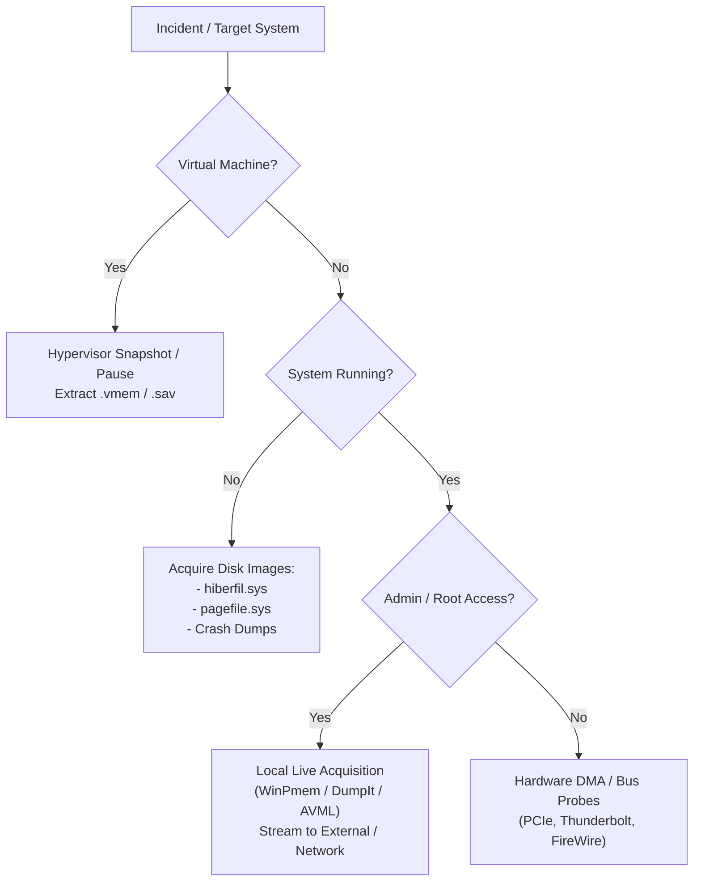
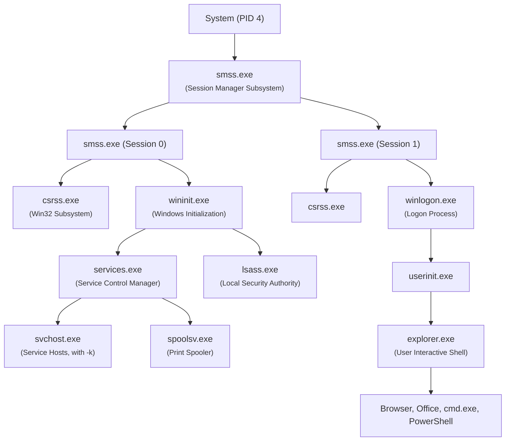
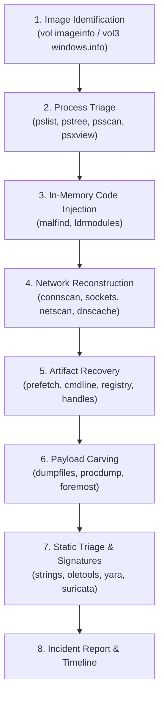

---
layout: agenda
title: Course Agenda
kicker: PV204 Overview
items:
  - { topic: Motivation & Legal Evidence, desc: "Why volatile memory forensics beats static disk analysis" }
  - { topic: Operating System Internals, desc: "Processes, threads, paging & kernel data structures" }
  - { topic: Subverting the OS (DKOM), desc: "Rootkit mechanics, process injection & unbacked memory" }
  - { topic: Acquisition Physics, desc: "Live hardware seizure, hypervisors & Heisenberg effect" }
  - { topic: Forensic Triage Tools, desc: "Redline, HBGary DDNA, Volatility 3, MemProcFS" }
  - { topic: Hands-on Malware Labs, desc: "Real-world memory triage: Zeus, Conficker, and Bob samples" }
---

---
layout: image
image: /images/xkcd-update.png
side: right
title: Why Memory Analysis?
kicker: The Human Factor
---

* **The Patching Reality**
  * Critical patches fix severe vulnerabilities...
  * Yet users reflexively click *"Remind me later"*.
* **Why We Need Volatile Forensics**
  * Systems remain unpatched in production for months.
  * When perimeter security fails, memory holds the truth.

<!--
XKCD #1328: https://xkcd.com/1328/
What’s the real cause of all the security issues on laptops and desktops? This one :)
-->

---
layout: panels
title: Why Memory Analysis?
kicker: Core Motivations
panels:
  - { icon: "lucide:scale", title: Legal & Corporate Evidence, items: ["Establishes root cause & timeline", "Proves unauthorized execution", "Court-admissible adversary state"] }
  - { icon: "lucide:unlock", title: Bypass Anti-Reversing, items: ["Code runs in plaintext in RAM", "Packers & crypters are defeated", "Exposes dynamically resolved APIs"] }
  - { icon: "lucide:zap", title: Fast Incident Triage, items: ["Captures fileless / in-memory implants", "RAM (8–64 GB) is fast to analyze", "Preserves volatile network connections"] }
---

---
layout: image
image: /images/xkcd-heartbleed.png
side: right
title: Secrets Trapped in RAM
kicker: Volatile Vulnerabilities
---

* **The Scope of Memory Exposure**
  * Encryption keys, TLS session tickets, private communications.
  * In-memory caches hold plaintext credentials ().
* **Hardware-Level Leaks**
  * Attacks like Heartbleed, Spectre, and Meltdown bypass OS protections by harvesting data directly from volatile RAM.

<!--
XKCD #1354: https://xkcd.com/1354/
Or you could consider Spectre/Meltdown, which still have related techniques and speculative execution side-channel attacks that haven’t been fully mitigated in hardware.
-->

---
layout: panels
title: Challenges in Reverse Engineering
kicker: Traditional Anti-Analysis Roadblocks
panels:
  - { icon: "lucide:binary", title: Binary Complexity, items: ["Multiple CPU architectures (x86, x64, ARM64)", "Undocumented instructions & opaque opcodes", "Non-standard ABI behaviors"] }
  - { icon: "lucide:bug-off", title: Anti-Debugging, items: ["SEH manipulation & hardware breakpoints", "RDTSC timing checks & PEB BeingDebugged", "User-mode API inline hooks"] }
  - { icon: "lucide:box", title: Anti-VM & Sandbox, items: ["Instruction quirks (CPUID, SIDT, SLDT)", "Registry & driver artifact queries", "Screen resolution & human mouse checks"] }
  - { icon: "lucide:shield-alert", title: Packers & Crypters, items: ["VMProtect, Themida, UPX packing", "Dynamic API hashing (ROR13, Murmur)", "Multi-stage payload decryption"] }
---

---
layout: default
title: PE File Format Overview
---

<div class="flex justify-center">
  <Figure src="/images/pe-file-format.png" caption="Ange Albertini's PE101 poster (Corkami) — DOS Header, PE Header, Optional Header, and Sections" />
</div>

---
layout: section
title: Memory Architecture
subtitle: How Operating Systems Organize Physical & Virtual RAM
index: "01"
kicker: Section 1
---

---
layout: default
title: x86/x64 Memory Organization
---

* **Physical Memory (RAM)**
  * The actual hardware DRAM chips installed on the motherboard.
* **Virtual Memory (The "Book Index" Model)**
  * **Analogy**: Every process gets a book with identical page numbers (0 to 4 GB or 128 TB). But the operating system translates those logical page numbers into completely different physical shelves in the warehouse (RAM).
  * **Isolation**: Process A cannot accidentally read or overwrite Process B's memory.
  * **Logical > Physical**: Enabled via disk paging (swap / `pagefile.sys`).
* **Paging vs. Segmentation**
  * **Segmentation**: Historical model dividing memory into variable-sized segments (`CS`, `DS`, `SS`).
  * **Paging**: Modern model dividing memory into uniform **4 KB** blocks. Zero external fragmentation.

<Callout tone="info" icon="lucide:lightbulb">
  <strong>Why Memory Analysts Care About Paging & CR3:</strong><br/>
  Physical RAM is a raw, scrambled dump of billions of bytes. The CPU register <code>CR3</code> (Directory Table Base / <code>DTB</code>) holds the root address of the page translation table. When Volatility runs <code>imageinfo</code>, it hunts for this <code>DTB</code> pointer. <strong>Without CR3, virtual addresses cannot be resolved into running processes!</strong>
</Callout>

<!--
A note about AArch64 / ARM64 is introduced later in the deck to contrast with x86/x64 flat and paged addressing.
-->

---
layout: default
title: "x86 Address Translation: Segmentation & Paging"
---

<div class="flex justify-center">
  <Figure src="/images/x86-address-translation.png" caption="Complete x86 Logical to Linear (GDT) and Linear to Physical (CR3 / Page Tables) Translation Pipeline" />
</div>

<!--
Page sizes in modern architectures: 4 KB (standard), 2 MB (large/huge page), 1 GB (gigabyte page), and proposed 512 GB pages.
-->

---
layout: two-cols
title: Logical vs. Physical Address Space
kicker: Memory Virtualization
---

<Figure src="/images/logical-vs-physical-memory.png" caption="Process logical pages mapped to disjointed physical DRAM frames" />

::right::

<Figure src="/images/paging-tables-disk.png" caption="Page tables with valid/invalid bits backed by swap/pagefile on disk" />

<!--
Reference: https://minnie.tuhs.org/CompArch/Lectures/week06.html
In other words, various isolated processes are multiplexed onto and share the same underlying physical memory frames.
-->

---
layout: two-cols
title: 32-bit Virtual Address Space
kicker: Windows vs. Linux
---

### Windows (Win32)
* **Default**: 2 GB User / 2 GB Kernel
* **`/3GB` switch**: 3 GB User / 1 GB Kernel

<Figure src="/images/win32-address-space.png" caption="Windows Win32 2GB/2GB vs 3GB/1GB split" />

::right::

### Linux (x86)
* **Default**: 3 GB User / 1 GB Kernel
* **`HugeMem`**: 4 GB User / 4 GB Kernel

<Figure src="/images/linux-address-space.png" caption="Linux x86 3GB/1GB vs 4GB/4GB HugeMem split" />

---
layout: image
image: /images/xkcd-pointers.png
side: right
title: Memory Addresses & Pointers
kicker: OS Fundamentals
---

* **Virtual Pointers**
  * , , ...
* **Why Pointers Matter in DFIR**
  * Windows kernel structures (, ) are connected solely by pointers (, ).
  * Rootkits unlink pointers to evade listing APIs, but physical memory pointers don't lie.

<!--
XKCD #138: https://xkcd.com/138/
-->

---
layout: default
title: x86_64 vs. ARM64 Memory Architecture
---

<div class="flex justify-center">
  
</div>

---
layout: default
title: ARM64 Memory Organization
---

Modern hardware architectures (e.g. Apple Silicon, ARM servers) introduce architectural differences:

* **Physical Memory (RAM)**
  * Standard DRAM layout accessed via system bus.
* **Paging Architecture**
  * Uses **4-level page tables** (e.g., L0 $\to$ L1 $\to$ L2 $\to$ L3 translation).
  * Configurable translation granule sizes: **4 KB**, **16 KB**, or **64 KB** pages.
* **No Segmentation Available**
  * **Major architectural difference from x86/x64**: ARM64 completely abandons segmentation.
  * Modern operating systems and compilers use a flat memory model anyway, making segmentation obsolete.

<!--
A note about AArch64: In general, it looks somewhat similar to x86_64 — there is a TLB, translation tables, configurable granule page sizes (4 KB, 16 KB, or 64 KB; 2 MB and 1 GB blocks), and multiple levels (up to 4-level page tables indexed by TTBR0_EL0 for user space and TTBR1_EL1 for kernel space).
-->

---
layout: default
title: ARM64 Memory Translation Architecture
---

<div class="flex justify-center">
  <Figure src="/images/arm64-memory-translation.png" caption="ARM64 Translation: TTBR0_EL0 (User) and TTBR1_EL1 (Kernel) Multi-Level Page Tables" />
</div>

---
layout: section
title: OS Internals & DKOM
subtitle: Processes, Kernel Structures, and Rootkit Evasion
index: "02"
kicker: Section 2
---

---
layout: image
image: /images/os-data-structures-isometric.png
side: right
title: Operating System Data Structures
kicker: Kernel Internals
---

* **Process & Thread Tracking**
  * Windows manages execution state via C structures (`EPROCESS`, `ETHREAD`, `FILE_OBJECT`).
* **Doubly-Linked Lists (`LIST_ENTRY`)**
  * Circular lists with `Flink` (forward) and `Blink` (backward) pointers.
  * Connects active processes (`ActiveProcessLinks`), loaded DLLs, and open handles.
* **Direct Kernel Object Manipulation (DKOM)**
  * Rootkits alter kernel pointers directly to unhook malicious objects from active lists.

---
layout: image
image: /images/doubly-linked-list.png
side: right
title: Doubly-Linked Lists (`LIST_ENTRY`)
kicker: Windows Kernel Internals
---

* **Circular Linked Structure**
  * `LIST_ENTRY` embeds `Flink` (forward) and `Blink` (backward) pointers.
  * Connects critical kernel objects: `EPROCESS`, `ETHREAD`, handles, drivers.
* **The Rootkit Mechanism (DKOM)**
  * Unlinking a process from `ActiveProcessLinks` hides it from APIs.
  * Yet CPU scheduler structures keep executing the stealth threads.

<!-- Circular linked list structure linking EPROCESS blocks via Flink and Blink pointers -->

---
layout: default
title: "DKOM: Direct Kernel Object Manipulation"
---

* **Dozens of Doubly-Linked Lists in Windows**
  * Maintained by the NT kernel for processes, threads, open handles, drivers, and network sockets.
* **DKOM is Extensively Used by Rootkits**
  * Unlinking the rootkit's `EPROCESS` block from `ActiveProcessLinks`.
  * The process disappears from API calls (`EnumProcesses`, `Process32First/Next`, Task Manager).
* **The Rootkit Paradox**
  * *To do damage, the malware must execute on the CPU.*
  * *To execute on the CPU, the thread must remain in the kernel scheduler.*
  * Therefore, even if unlinked from process lists, the thread structures still reside in physical memory!

<Callout tone="warn" icon="lucide:shield-alert">
  <strong>The Classroom Attendance Roster Analogy:</strong><br/>
  Imagine a student sneaks up and erases their name from the classroom attendance sheet. When the teacher reads the list (<code>vol pslist</code>), the student is reported absent! But if the teacher walks down the aisles inspecting physical chairs for living human beings (<code>vol psscan</code>), the student is caught red-handed.
</Callout>

<!--
Historical milestone paper: Jamie Butler (Black Hat USA 2004) - 'FU Rootkit / Direct Kernel Object Manipulation':
http://www.blackhat.com/presentations/bh-usa-04/bh-us-04-butler/bh-us-04-butler.pdf
-->

---
layout: panels
title: High-Value Memory Structures
kicker: Windows Kernel Forensic Targets
panels:
  - { icon: "lucide:cpu", title: Execution State, items: ["EPROCESS blocks & thread objects", "VAD (Virtual Address Descriptor) trees", "Unbacked executable allocations"] }
  - { icon: "lucide:network", title: Network & Handles, items: ["Open TCP/UDP sockets & connections", "Active file & mutant handles", "Injected thread descriptors"] }
  - { icon: "lucide:file-code", title: Code & Modules, items: ["PEB->Ldr loaded DLL lists", "Prefetch, Shimcache & UserAssist", "Infection marker mutexes"] }
  - { icon: "lucide:key", title: Secrets & Caches, items: ["LSA cached domain credentials", "In-memory registry hives", "DNS client resolver cache"] }
---

---
layout: default
title: "Memory Page Protections & W^X"
---

* **Page Protection Flags**
  * Memory pages enforce permissions: `READONLY`, `READWRITE`, `EXECUTE_READ`, `EXECUTE_READWRITE`.
  * The MMU hardware enforces Data Execution Prevention (**DEP** / **W^X**).
* **Process Injection Staging**
  * Malware allocates memory in a victim process (`VirtualAllocEx`).
  * Writes payload code (`WriteProcessMemory`).
  * Executes via `CreateRemoteThread`, `QueueUserAPC`, or Process Hollowing.

<Callout tone="warn" icon="lucide:shield-alert">
  <strong>The RWX Red Flag:</strong> Legitimate binaries strictly separate executable code (<code>.text</code> = RX) from writable data (<code>.data</code> = RW). A memory page that is simultaneously <strong>writable AND executable (PAGE_EXECUTE_READWRITE)</strong> is a prime indicator of unpacked shellcode staging!
</Callout>

---
layout: two-cols
title: Process & DLL Injection Mechanics
kicker: In-Memory Evasion
---

### Remote Thread Injection
1. `OpenProcess(PROCESS_ALL_ACCESS)`
2. `VirtualAllocEx(PAGE_EXECUTE_READWRITE)`
3. `WriteProcessMemory(...)`
4. `CreateRemoteThread(...)`

<Figure src="/images/process-injection-steps.png" caption="Direct remote thread allocation & invocation" />

::right::

### Process Hollowing
1. Spawn host suspended (`CREATE_SUSPENDED`)
2. Unmap original code (`NtUnmapViewOfSection`)
3. Allocate RWX and write malware PE
4. Rewrite thread context (EIP/RIP) & resume

<Figure src="/images/process-hollowing.png" caption="Hollowing out legitimate system binaries" />

<!--
Reference: Endgame Technical Survey - 'Ten Process Injection Techniques: A Technical Survey of Common and Trending Process Injection Techniques':
https://www.endgame.com/blog/technical-blog/ten-process-injection-techniques-technical-survey-common-and-trending-process
-->

---
layout: default
title: And Now Something Completely PRACTICAL
---

<div class="flex flex-col items-center justify-center mt-6">
  <Figure src="/images/practical-forensics-banner.png" caption="Transitioning from operating system theory to applied volatile memory acquisition" />
</div>

---
layout: image
image: /images/xkcd-adobe-update.png
side: right
title: Endless Updates & Breaches
kicker: Practical Forensics
---

* **The Update Fatigue Paradox**
  * Infinite update chains, installers, and downloaders.
* **Transition to Acquisition**
  * Live malware triage begins where endpoint defenses failed.

<!--
XKCD #1197: https://xkcd.com/1197/
The joke is from 2013, but it’s still pretty good and accurate. There’s no extra hidden meaning of this joke right here; it’s just to give students a short break and relax a bit before diving into acquisition.
-->

---
layout: image
image: /images/forensic-hardware-hotplug.png
side: right
title: Physical Seizure & Power Preservation
kicker: Hardware Triage
---

* **The Race Against Power Loss**
  * Pulling power drops DRAM state within seconds.
  * Sleeping or screen locking triggers disk encryption or clears volatile session keys.
* **Hardware Seizure Kit**
  * **WiebeTech HotPlug LT**: Transfers running desktop power to a UPS battery pack without dropping an AC cycle!
  * **Mouse Jiggler**: USB dongle preventing screensavers and sleep mode during physical transit.

<!--
Can anybody guess what this stuff is for? It’s used for transportation of desktops/servers from their original location to a forensic lab somewhere else, without any power interruption, so that volatile RAM content is preserved.
-->

---
layout: section
title: Memory Acquisition
subtitle: Live Seizure Physics, Hypervisors & Footprint Mitigation
index: "03"
kicker: Section 3
---

---
layout: panels
title: Memory (Re)sources
kicker: Volatile Artifact Sources
panels:
  - { icon: "lucide:cpu", title: Live RAM, items: ["Most volatile & complete evidence", "Running malware, keys & network sockets", "Cleanest capture from hypervisors (.vmem)"] }
  - { icon: "lucide:file-text", title: Pagefile / Swap, items: ["pagefile.sys on disk", "Inactive pages flushed by OS manager", "Yields historical process fragments"] }
  - { icon: "lucide:save", title: Hibernation & Dumps, items: ["hiberfil.sys compressed RAM snapshot", "MEMORY.DMP crash dump state", "Valuable if machine was powered off"] }
---

---
layout: diagram
title: Memory Acquisition Decision Tree
kicker: Forensic Methodology
note: Choosing the optimal preservation strategy based on virtualization and privilege level
---



---
layout: panels
title: Memory Acquisition Methods
kicker: Forensic Preservation Techniques
panels:
  - { icon: "lucide:server", title: Hypervisors, items: ["VMware (.vmem), VirtualBox, KVM", "Snapshot / pause virtual guest", "Zero software footprint inside OS"] }
  - { icon: "lucide:hard-drive", title: OS Live Acquisition, items: ["WinPmem, DumpIt, FTK CLI", "AVML & LiME for Linux", "Kernel driver loads into live host"] }
  - { icon: "lucide:network", title: Remote Enterprise, items: ["Velociraptor, Binalyze AIR", "EDR-integrated telemetry pulls", "Fleet-scale live response"] }
---

---
layout: default
title: Common Acquisition Challenges
---

* **The "Heisenberg Effect" (Tool Footprint)**
  * Running an acquisition tool *on the live machine* modifies memory!
  * Overwrites unallocated RAM, allocates buffers, creates processes (`win32dd.exe`).
  * **Rule:** Minimize footprint; stream output to external USB or network share.
* **Paging & Swap**
  * Key payload code or strings may have been paged out to disk.
* **Full-Disk Encryption (BitLocker / FileVault)**
  * Cold shutdowns render RAM unreachable and lock disk volumes. Live memory acquisition preserves encryption keys!
* **Malware Anti-Forensics**
  * Kernel rootkits hooking memory device objects (`\Device\PhysicalMemory`).
  * Anti-VM logic terminating upon detecting virtualization.

---
layout: default
title: Local Memory Acquisition Best Practices
---

* **Admin / Root Privileges**
  * Kernel-level driver access is strictly required to read physical memory on modern operating systems.
* **Output Destination**
  * **Never write the memory image to the system drive!** This overwrites deleted files and filesystem metadata.
  * Write directly to a pre-mounted external USB drive or stream over netcat/SSH.
* **Virtual Machine Sizing Strategy**
  * If executing malware in a dedicated analysis VM, allocate **less RAM (e.g. 2 GB–4 GB)**.
  * Less RAM = Faster dump times, faster Volatility parsing, less noise.
  * Disable swap / pagefile in the guest to ensure all artifacts remain in physical RAM.

---
layout: default
title: Remote Memory Acquisition
---

* **Fast Incident Response at Scale**
  * Triage compromised servers or endpoints across global networks without travel.
* **Agent Architecture**
  * Forensic agents already running in memory have pre-allocated footprints.
  * Captured image is encrypted and streamed directly over TLS to the evidence server.
* **Enterprise Tooling**
  * Velociraptor, Binalyze AIR, Cybereason, EnCase Endpoint Investigator.
  * Supported natively by leading cloud-native EDR/XDR suites.

<!--
Very useful for fast Incident Response across large enterprise fleets without physical travel. Requires enterprise EDR/XDR agents or query frameworks like Velociraptor.
-->

---
layout: section
title: Forensic Triage Tools
subtitle: Redline, HBGary DDNA, Volatility 3, and MemProcFS
index: "04"
kicker: Section 4
---

---
layout: default
title: Memory Analysis Tool Ecosystem
---

* **FireEye Redline**
  * Free GUI-based tool for Windows incident response and triage.
  * Proprietary, runs on Windows (.NET).
* **HBGary / CounterTack Responder Pro**
  * High-end commercial memory analysis platform.
  * Introduced **Digital DNA (DDNA)** behavioral scoring.
* **The Volatility Framework**
  * The open-source industry standard.
  * Python-based, cross-platform, modular, CLI-driven.

---
layout: image
image: /images/redline-time-wrinkles.png
side: right
title: FireEye Redline & "Time Wrinkles"
kicker: Forensic Triage Tools
---

* **Historical Role (2010s)**
  * Free GUI triage tool developed by Mandiant / FireEye.
  * Introduced **MRI (Malware Risk Index)** scoring for suspicious processes.
* **The "Time Wrinkles" Innovation**
  * Clustered forensic events visually across time.
  * Solved timeline analysis by graphing activity spikes around the breach window.
* **Why Modern DFIR Has Moved On**
  * Sluggish on large dumps; Windows-only (.NET).
  * Lacks depth for DKOM, hidden VADs, and raw carving.
  * Replaced by **Velociraptor**, **Volatility 3**, and **MemProcFS**.

<!--
Support for macOS and Linux memory artifacts was added in Redline in 2020, but it remains predominantly a Windows-centric triage tool.
-->

---
layout: image
image: /images/responder-ddna.png
side: right
title: HBGary Responder Pro & Digital DNA
kicker: Forensic Triage Tools
---

* **A Visionary Milestone in DFIR**
  * Pioneered by rootkit researcher **Greg Hoglund** (HBGary / CounterTack).
  * First platform to treat memory analysis as **behavioral genotyping**.
* **Why DDNA Was Ahead of Its Time**
  * Disassembled unbacked in-memory code blocks across processes.
  * Mapped patterns into discrete **behavioral traits/genes**.
  * Evaluated composite risk: *Does code resolve APIs via hashing AND open a raw TCP socket?*
* **The Lingering Void**
  * Today's tools still output raw tables (`malfind`, `netscan`).
  * Automated semantic "gene sequencing" for memory remains an ideal.

<!--
Obsolete and unavailable for a long time, but it pioneered groundbreaking behavioral heuristics.
Commercial successor / alternative references:
- GoSecure Responder Pro: https://www.gosecure.net/responder-pro
- CounterTack DDNA SC Magazine Overview: https://cdn2.hubspot.net/hubfs/150964/CounterTack_DDNA_SCMagazine_030117-1.pdf
-->

---
layout: default
title: "Digital DNA: Behavioral Gene Scoring"
---

Instead of brittle file hashes or static strings, DDNA classifies code capabilities into trait categories:

<div class="grid grid-cols-2 gap-4 text-sm">
<div>

* **Execution Anomaly Genes**
  * Code executing from unbacked (non-file) memory (`PAGE_EXECUTE_READWRITE`)
  * Self-modifying code or runtime unpacker stubs
  * Manual PE header parsing / API resolving by hash
* **Privilege & Evasion Genes**
  * Direct kernel object manipulation (DKOM)
  * Modifying security privileges (`SeDebugPrivilege`)
  * Hooking SSDT, IRP major functions, or inline trampolines

</div>
<div>

* **Communication & Persistence Genes**
  * Raw TCP/UDP socket creation from unexpected processes
  * Manipulating Run keys or active service descriptors
  * Injecting threads into critical system processes (`lsass.exe`, `explorer.exe`)
* **Composite Threat Score**
  * Benign tools may possess 1–2 traits (e.g., packed commercial software).
  * Malicious implants exhibit a lethal **combination** of traits, yielding a 90+ DDNA severity score.

</div>
</div>

---
layout: default
title: "Responder Pro: DDNA Trait Severity Scoring"
---

<div class="flex justify-center">
  <Figure src="/images/responder-ddna-details.png" caption="Responder Pro: DDNA Trait Severity Scoring & Composite Threat Rating" />
</div>

---
layout: default
title: "Responder Pro: Visual Canvas Disassembler"
---

<div class="flex justify-center">
  <Figure src="/images/responder-canvas.png" caption="Responder Pro: Visual Canvas In-Memory Disassembler & Control Flow Graph" />
</div>

---
layout: default
title: The Volatility Framework
---

* **The Gold Standard in Memory Forensics**
  * Open source (GPL license), completely free.
  * Actively maintained by the Volatility Foundation and global DFIR community.
* **Core Characteristics**
  * Written in **Python**; runs natively on Linux, macOS, and Windows.
  * Fast, scriptable, easily automated in CI/CD and triage pipelines.
* **Comprehensive OS Support**
  * Windows (XP through Windows 11 / Server 2025).
  * Linux (kernels 2.6.x through 6.x).
  * macOS & Android.
* **Dual Toolchain in Our Lab**
  * **Volatility 2 (`vol`)**: Essential for legacy Windows XP (raw socket scans, `dnscache`).
  * **Volatility 3 (`vol3`)**: Modern framework rewrite for Windows 10/11 & 64-bit systems.

---
layout: panels
title: The Modern Memory Forensics Landscape
kicker: Beyond Classic Volatility
panels:
  - { icon: "lucide:terminal", title: Volatility 3, items: ["Python 3 modular framework", "Automated PDB symbol download", "Cross-platform kernel analysis", "Deep offline artifact recovery"] }
  - { icon: "lucide:cpu", title: MemProcFS, items: ["C/Rust ultra-high performance", "Mounts RAM as virtual filesystem", "Instantaneous search & DMA", "Ultra-fast live memory triage"] }
  - { icon: "lucide:network", title: Velociraptor, items: ["Go enterprise telemetry engine", "VQL-driven endpoint sweeps", "Live triage across 50,000+ hosts", "Enterprise-scale fleet response"] }
---

---
layout: default
title: Additional Essential CLI Tools
---

### `strings`
* Extracts printable character sequences from binary files and memory dumps.
* **Beware of text encoding!**
  * Standard ASCII strings: `strings -a sample.vmem`
  * 16-bit Little-Endian Unicode (default in Windows kernel): `strings -a -e l sample.vmem`

### `foremost`
* Open-source file carving utility.
* Recovers files from memory dumps based on file format headers, footers, and internal data structures:
  * Office documents (`.doc`, `.rtf`, `.docx`)
  * PDF files, images (`.jpg`, `.png`), PE executables (`.exe`, `.dll`)

---
layout: default
title: Foremost File Carving
---

<div class="flex justify-center">
  <Figure src="/images/foremost-carving.png" caption="Foremost: File Header & Footer Magic Number Carving from Memory Dumps" />
</div>

---
layout: default
title: Forensic Timeline from Memory
---

<div class="flex justify-center">
  <Figure src="/images/ram-forensics-timeline.png" caption="Reconstructed Forensic Timeline from Volatile Memory Artifacts" />
</div>

---
layout: default
title: "What to Search for in Volatile Memory?"
---

<div class="grid grid-cols-2 gap-4">
<div>

### 1. Process Anomalies
* Hidden / unlinked processes (DKOM)
* Non-standard process parent-child trees
* Process hollowing / DLL injection

### 2. Network Artifacts
* Command & Control (C2) connections
* Open listening UDP/TCP sockets
* Cached DNS queries (`mialepromo.ru`)

</div>
<div>

### 3. Execution & Persistence
* Prefetch execution records
* In-memory registry run keys
* Command-line history buffers

### 4. Forensic Secrets
* Known bad Mutexes (infection markers)
* Decrypted SSL/TLS traffic in heap
* In-memory encryption keys & passwords

</div>
</div>

---
layout: default
title: Known Bad Mutexes (Malware Infection Markers)
---

Malware frequently creates named mutexes to prevent infecting the same host twice:

| Malware Family | Mutex Name Pattern | Description |
| :--- | :--- | :--- |
| **Conficker** | `.*-7` and `.*-99` | Net-worm worm mutex algorithm |
| **Sality.AA** | `Op1mutx9` | File infector / polymorphic virus |
| **Sality.W** | `u_joker_v3.06` | Sality backdoor variant |
| **Flystud** | `Hacker.com.cn_MUTEX` | Chinese crimeware backdoor |
| **NetSky** | `'D'r'o'p'p'e'd'S'k'y'N'e't'` | Mass-mailing email worm |
| **Poison Ivy** | `)!VoqA.I4` | Widely used remote access trojan (RAT) |
| **Koobface** | `35fsdfsdfgfd5339` | Social networking botnet |

<!--
Reference: Adam's Hexacorn blog - 'Santa's Bag of Mutants':
http://hexacorn.com/examples/2014-12-24_santas_bag_of_mutants.txt
-->

---
layout: diagram
title: Windows Process Lineage (Expected Tree)
kicker: Process Anomaly Detection
note: Legitimate Windows processes follow a deterministic hierarchy stemming from System (PID 4)
---



---
layout: default
title: "Spotting Process Masquerading & Anomalies"
---

Adversaries blend in by masquerading as standard Windows processes. Look for these red flags:

<div class="grid grid-cols-2 gap-4 text-xs">
<div>

### 1. Parentage Violations
* `svchost.exe` spawned by `explorer.exe` or `cmd.exe` instead of `services.exe`.
* `services.exe` or `lsass.exe` spawned by anything other than `wininit.exe` (or `winlogon.exe` on XP).
* `cmd.exe` or `powershell.exe` spawned by `spoolsv.exe` or `sqlserver.exe`.

### 2. Path Masquerading & Typo-squatting
* System binaries must reside in `%SystemRoot%\System32\`.
* Red flag paths: `C:\Users\...\AppData\`, `C:\Temp\`, `C:\Windows\svchost.exe`.
* Typo-squats: `svch0st.exe`, `scvhost.exe`, `lsas.exe`, `csrs.exe`.

</div>
<div>

### 3. Instance Counts & CLI Arguments
* **Singletons**: Exactly ONE instance of `System`, `wininit.exe`, `services.exe`, `lsass.exe`. If you see two `lsass.exe`, one is an implant!
* `svchost.exe` **must** always have a `-k <group>` command-line argument. Naked `svchost.exe` without flags is malicious.

### 4. Memory Anomalies
* **Process Hollowing**: Process points to valid binary on disk, but in RAM the `.text` section is unmapped and replaced with injected shellcode (`PAGE_EXECUTE_READWRITE`).
* Detected with Volatility's `malfind` and `ldrmodules`.

</div>
</div>

---
layout: default
title: "Memory Tracing & Dynamic Binary Instrumentation"
---

* **Single Process Memory Focus**
  * Combining live memory emulation with instrumentation.
* **Capabilities**
  * Real-time tracking of memory page allocation and modification.
  * API parameter hooking and execution tracing.
* **Modern Open-Source Instrumentation Frameworks**
  * **Frida**: Dynamic instrumentation toolkit for developers and reverse engineers.
  * **Intel PIN**: Binary instrumentation engine for x86/x64.
  * **DynamoRIO**: Runtime code manipulation system.
  * **Qiling Framework**: Cross-platform multi-architecture binary emulation.

<!--
It’s usually not about snapshotting memory (or a single static memory dump), but about tracking dynamic changes in real-time, tracing code execution, and instrumenting the emulator or runtime code on what to do next.
-->

---
layout: section
title: Operational Security (OpSec)
subtitle: Safe Handling of Carved Malware Payloads
index: "05"
kicker: Section 5
---

---
layout: default
title: Operational Security (OpSec) Best Practices
---

* **The "Think Before You Act" Mentality**
  * Malware carved from RAM can still be fully functional and weaponized!
* **Handling Carved Samples**
  * Always analyze extracted payloads inside an isolated, non-networked VM.
  * Use host-only virtual networking during malware reverse engineering.

<Callout tone="bad" icon="lucide:alert-triangle">
  <strong>VirusTotal Hazard:</strong> Never upload unredacted memory carvings or full dumps to VirusTotal. Attackers monitor hash submissions to detect when their implants are discovered, and raw memory dumps routinely expose plaintext credentials, active session tokens, and confidential corporate data!
</Callout>

---
layout: diagram
title: Recommended Forensic Analysis Workflow
kicker: Investigation Methodology
note: Structured 8-step pipeline from volatile image identification to signature authoring
---



---
layout: default
title: "More Information & Learning Resources"
---

* **Course Website**: [https://dior.ics.muni.cz/~valor/pv204](https://dior.ics.muni.cz/~valor/pv204)
* **Reverse Engineering for Beginners**: Dennis Yurichev's free, legendary book.
* **REMnux**: The premier Linux distribution for reverse engineering and malware analysis.
* **ContagioDump**: Curated archive of real-world malware samples and analysis briefs.
* **Malware Traffic Analysis**: Brad Duncan's pcap challenges and infection traffic exercises.
* **The Art of Memory Forensics**: The definitive textbook by the Volatility core developers.

---
layout: default
title: "Questions & Answers"
---

### *Thank you for your attention!*

<div class="flex justify-center mt-6">
  <Figure src="/images/qa-puzzle.png" caption="Questions, discussions, and lab setup troubleshooting" />
</div>

---
layout: section
title: Hands-on Malware Labs
subtitle: Practical Memory Forensics with Volatility
index: "06"
kicker: Section 6
---

---
layout: default
title: "Lab Environment & Requirements"
---

* **Virtualization**
  * Oracle VM VirtualBox or Docker Desktop (Apple Silicon / Linux / Windows).
  * At least 12 GB of free disk space and 4 GB RAM allocated to the VM.
* **Forensic Software**
  * Volatility Framework 2.7 (`vol`) & Volatility 3 (`vol3`).
  * Linux command-line utilities (`strings`, `foremost`, `grep`, `file`).
  * Document analysis tools (`oletools`, `rtfobj`, `peepdf`).
* **Text Editor**
  * Your favorite text editor for taking structured analysis notes and writing reports.

---
layout: default
title: Volatility 2 Cheat Sheet
---

| Command / Plugin | Purpose |
| :--- | :--- |
| `vol imageinfo` | Detect operating system, Service Pack, and suggested profile |
| `vol pslist` / `pstree` | Display active processes and parent/child hierarchy |
| `vol psscan` / `psxview` | Scan physical memory for hidden/unlinked processes (DKOM) |
| `vol connections` / `connscan` | List active / historical TCP connections (WinXP) |
| `vol sockets` / `sockscan` | Identify open listening TCP and UDP sockets (WinXP) |
| `vol netscan` | Comprehensive network scan for Windows 7 / 10 / 11 |
| `vol malfind -D dump/` | Detect unbacked executable allocations (`PAGE_EXECUTE_READWRITE`) |
| `vol ldrmodules` | Detect unlinked DLLs hidden from the PEB |
| `vol filescan` / `dumpfiles` | Scan for `FILE_OBJECT` structures and extract cached files to disk |
| `vol cmdscan` / `consoles` | Extract command history and console buffer text |
| `vol prefetchparser` | Parse execution records from Windows prefetch |
| `vol dnscache --dump_dir dir/` | Dump DNS resolution cache from `dnsrslvr.dll` memory |

---
layout: default
title: "Exercise 1: `xp-infected.vmem`"
---

* **Command**:
  ```bash
  exercise 1
  ```
* **Recommended Tools**:
  * Volatility 2 (`vol`), `strings`, `rtfobj`, `yara`
* **Objectives**:
  1. Identify the operating system profile and acquisition timestamp.
  2. Find the suspicious parent-child process relationships (`cmd.exe`, `wordpad.exe`, `win32dd.exe`).
  3. Identify the terminated dropper process (PID `1204`).
  4. Uncover the C2 IP, resolved domain (`mialepromo.ru`), and listening UDP socket.
  5. Carve the dropped decoy document and determine its true file format.
  6. Author YARA and Suricata detection signatures for the campaign.

*📖 See `report/report.md` for the complete sample forensic report!*

---
layout: default
title: "Exercise 2: `win7_x64.vmem`"
---

* **Command**:
  ```bash
  exercise 2
  ```
* **Recommended Tools**:
  * Volatility 2 (`vol`) or Volatility 3 (`vol3`)
* **Objectives**:
  1. Transition to a **64-bit Windows architecture**.
  2. Note differences in memory layout, process structures, and pointer sizes.
  3. Use `netscan` instead of `connscan` to inspect modern network objects.
  4. Inspect token privileges (`privs`) and identify process injection using `malfind`.

---
layout: default
title: "Exercise 3: `zeus.vmem`"
---

* **Command**:
  ```bash
  exercise 3
  ```
* **Recommended Tools**:
  * Volatility 2 (`vol`)
* **Objectives**:
  1. Triage the infamous **Zeus (Zbot)** banking trojan.
  2. Find suspicious network connections and C2 beaconing.
  3. Identify which legitimate process was hollowed/injected to conduct the banking theft.
  4. Find the infection mutex used by Zeus.

---
layout: default
title: "Exercise 4: `zeus2x4.vmem`"
---

* **Command**:
  ```bash
  exercise 4
  ```
* **Recommended Tools**:
  * Volatility 2 (`vol`)
* **Objectives**:
  1. Advanced Zeus variant analysis.
  2. Identify the process responsible for network activity.
  3. Dump the injected virus payload and recover its decrypted configuration from memory heap!

---
layout: default
title: "Exercise 5: `bob.vmem`"
---

* **Command**:
  ```bash
  exercise 5
  ```
* **Recommended Tools**:
  * Volatility 2, Foremost, Strings, Oletools
* **Objectives**:
  1. Reconstruct Uncle Bob's user activity leading to compromise.
  2. Uncover the initial infection vector: What caused the infection?
  3. Carve the malicious file from memory.
  4. **What known vulnerability (CVE) was exploited?**

---
layout: default
title: Lab Report Requirements
---

When submitting your laboratory assignment:

* **Structure your findings logically**:
  * Executive Summary $\to$ Image Metadata $\to$ Process Triage $\to$ Network Analysis $\to$ In-Memory Artifacts $\to$ Timeline $\to$ IOCs/Signatures.
* **Correlate artifacts**:
  * Don't just list raw tool outputs. Explain *how* the artifacts link together into an attack story.
* **Actionable Detection**:
  * Provide functional YARA rules and network detection signatures.
* **Reference**:
  * Follow the structure demonstrated in [`report/report.md`](file:///home/valor/Devel/personal/vagrant-memory-analysis/report/report.md).

---
layout: end
title: Good Luck with the Analysis!
subtitle: May your page tables always resolve and your DKOM scans be fruitful.
contact: PV204 Security Technologies · Masaryk University
---


